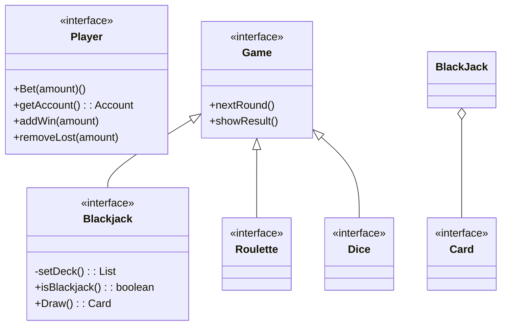
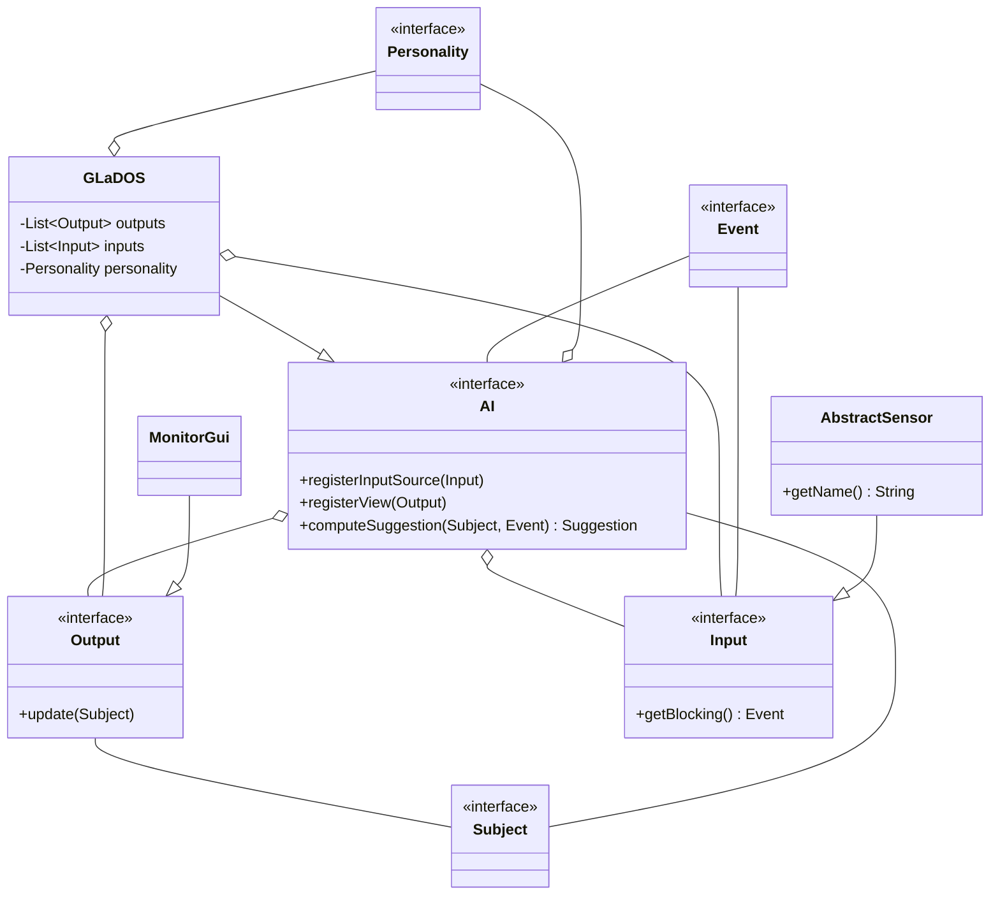
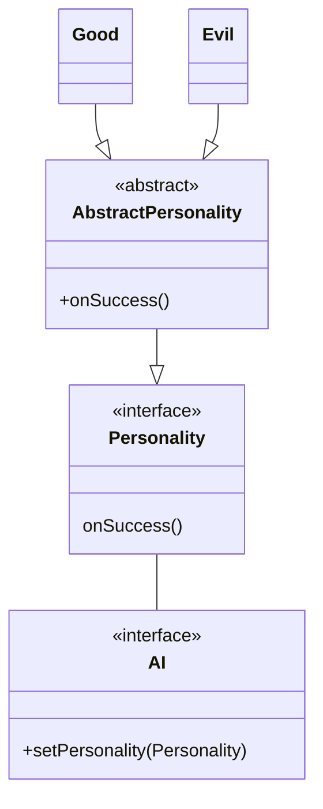
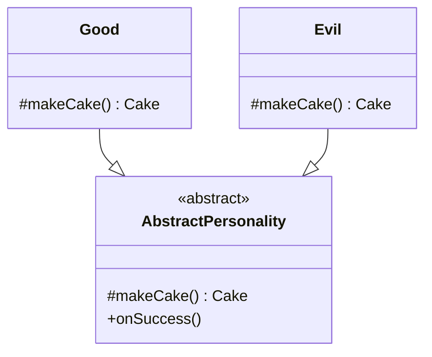
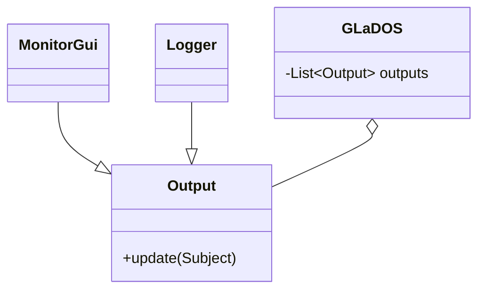

# Meta-relazione per Progettazione e Sviluppo del Software

# Analisi

## Requisiti

Il gruppo si pone come obiettivo la realizzazione di un Casinò simulato con diversi giochi e classifiche.

In modo da dare il brivido del gioco senza la paura di perdere vero capitale, infatti il giocatore potrà giocare liberamente finchè il suo credito sarà positivo (>0) e appena andrà in rosso verrà espulso.
Il casinò da la possibilità di terminare la partita in maniera definitiva ed entrare in classifica (se il punteggio sarà abbastanza grande) ma prima di inserire il proprio punteggio il giocatore potrà scegliere se tentare la fortuna ai dadi, dove il profitto verrà raddoppiato o dimezzato in base al risultato del gioco.

#### Requisiti funzionali
- Menù principale: schermata che verrà mostrata all'avvio del software, qui sarà possibile decidere se iniziare a giocare inserendo il proprio nome o se visionare la classifica;
- Realizzazione simulata di giochi da banco, nello specifico:
    - Blackjack: tramite interfaccia apposita i giocatori potranno ricevere carte e decidere se "restare" o richiedere carte, il banco si occuperà di dare e mescolare le carte;
    - Roulette: tramite tabellone sarà possibile fare le proprie puntate e aspettare il verdetto controllando la roulette;
    - Dadi [gioco bonus]: opzione bonus e facoltativa che si attiva alla decisione dell'utente di terminare la sessione di gioco per salvare il proprio punteggio, il giocatore dovrà inserire un numero cercando di indovinare la combinazione dei dadi;
- Organizzazione vincite tramite classifica: i records rappresenteranno nome, profitto blackjack, profitto roulette, fattore dado e il profitto totale.

#### Requisiti non funzionali

- Funzionalità drag and drop nella roulette, prendi le fiches e le trascini nelle caselle del tabellone per puntare.
- Funzionalità drag and "throw" nei dadi, sarà possibile trascinare un bicchiere che prende i dadi al suo interno, si potranno mischiare tramite   movimento del cursore e al rilascio i dadi verranno lanciati.
- Classifica non più locale ma online, tramite librerie per lo scambio di messaggi in rete la classifica si aggiornerà con i nomi di tutti coloro che hanno fatto un buon punteggio anche in istanze diverse dell'applicazione.
- Salvataggio partita a metà, possibilità di mettere in pausa la partita attuale per riprenderla successivamente anche alla chiusura dell'applicazione.

## Analisi e modello del dominio

All'interno dell'applicazione esistono diverse entità ma la principale è sicuramente **Player** che potrà scegliere di divertirsi nei vari **Game**




# Design

In questo capitolo si spiegano le strategie messe in campo per
soddisfare i requisiti identificati nell'analisi.

Si parte da una visione architetturale, il cui scopo è informare il
lettore di quale sia il funzionamento dell'applicativo realizzato ad
alto livello. In particolare, è necessario descrivere accuratamente in
che modo i componenti principali del sistema si coordinano fra loro. A
seguire, si dettagliano alcune parti del design, quelle maggiormente
rilevanti al fine di chiarificare la logica con cui sono stati
affrontati i principali aspetti dell'applicazione.

## Architettura

Questa sezione spiega come le componenti principali del software
interagiscono fra loro.

In questa sezione vanno descritte, per ciascun componente architetturale
che ruoli ricopre (due o tre ruoli al massimo), ed in che modo
interagisce (ossia, scambia informazioni) con gli altri componenti
dell'architettura.

### Elementi positivi

-   Si mostrano pochi, mirati schemi UML dai quali si deduce con
    chiarezza quali sono le parti principali del software e come
    interagiscono fra loro.

### Elementi negativi

-   Si presentano UML caotici, difficili da leggere.
-   Si presentano UML in cui sono mostrati elementi di dettaglio non
    appartenenti all'architettura, ad esempio includenti campi o con
    metodi che non interessano la parte di interazione fra le componenti
    principali del software.
-   Si presentano schemi UML con classi (nel senso UML del termine) che
    "galleggiano" nello schema, non connesse, ossia senza relazioni con
    il resto degli elementi inseriti.
-   Si presentano elementi di design di dettaglio, ad esempio tutte le
    classi e interfacce del modello o della view.
-   Si discutono aspetti implementativi, ad esempio eventuali librerie
    usate oppure dettagli di codice.

### Esempio

L'architettura di GLaDOS segue il pattern architetturale MVC. Più nello
specifico, a livello architetturale, si è scelto di utilizzare MVC in
forma "ECB", ossia "entity-control-boundary"[^4]. GLaDOS implementa
l'interfaccia AI, ed è il controller del sistema. Essendo una
intelligenza artificiale, è una classe attiva. GLaDOS accetta la
registrazione di Input ed Output, che fanno parte della "view" di MVC, e
sono il "boundary" di ECB. Gli Input rappresentano delle nuove
informazioni che vengono fornite all'IA, ad esempio delle modifiche nel
valore di un sensore, oppure un comando da parte dell'operatore. Questi
input infatti forniscono eventi. Ottenere un evento è un'operazione
bloccante: chi la esegue resta in attesa di un effettivo evento. Di
fatto, quindi, GLaDOS si configura come entità *reattiva*. Ogni volta
che c'è un cambio alla situazione del soggetto, GLaDOS notifica i suoi
Output, informandoli su quale sia la situazione corrente.
Conseguentemente, GLaDOS è un "observable" per Output.

Il seguente è lo schema UML architetturale di GLaDOS.
L'interfaccia `GLaDOS` è il
controller del sistema,
mentre `Input` ed `Output` sono le interfacce
che mappano la view (o, più correttamente in questo specifico esempio,
il boundary). Un'eventuale interfaccia grafica interattiva dovrà
implementarle entrambe.



Con questa architettura, possono essere aggiunti un numero arbitrario di
input ed output all'intelligenza artificiale. Ovviamente, mentre
l'aggiunta di output è semplice e non richiede alcuna modifica all'IA,
la presenza di nuovi tipi di evento richiede invece in potenza aggiunte
o rifiniture a GLaDOS. Questo è dovuto al fatto che nuovi Input
rappresentano di fatto nuovi elementi della business logic, la cui
alterazione od espansione inevitabilmente impatta il controller del
progetto.

In è esemplificato il diagramma UML architetturale.

## Design dettagliato

In questa sezione si possono approfondire alcuni elementi del design con
maggior dettaglio. Mentre ci attendiamo principalmente (o solo)
interfacce negli schemi UML delle sezioni precedenti, in questa sezione
è necessario scendere in maggior dettaglio presentando la struttura di
alcune sottoparti rilevanti dell'applicazione. È molto importante che,
descrivendo la soluzione ad un problema, quando possibile si mostri che
non si è re-inventata la ruota ma si è applicato un design pattern noto.
Che si sia utilizzato (o riconosciuto) o meno un pattern noto, è
comunque bene definire qual è il problema che si è affrontato, qual è la
soluzione messa in campo, e quali motivazioni l'hanno spinta. È
assolutamente inutile, ed è anzi controproducente, descrivere
classe-per-classe (o peggio ancora metodo-per-metodo) com'è fatto il
vostro software: è un livello di dettaglio proprio della documentazione
dell'API (deducibile dalla Javadoc).

**È necessario che ciascun membro del gruppo abbia una propria sezione
di design dettagliato, di cui sarà il solo responsabile**.

Ciascun
autore dovrà spiegare in modo corretto e giustamente approfondito (non
troppo in dettaglio, non superficialmente) il proprio contributo. È
importante focalizzarsi sulle scelte che hanno un impatto positivo sul
riuso, sull'estensibilità, e sulla chiarezza dell'applicazione.
Esattamente come nessun ingegnere meccanico presenta un solo foglio con
l'intero progetto di una vettura di Formula 1, ma molteplici fogli di
progetto che mostrano a livelli di dettaglio differenti le varie parti
della vettura e le modalità di connessione fra le parti, così ci
aspettiamo che voi, futuri ingegneri informatici, ci presentiate prima
una visione globale del progetto, e via via siate in grado di
dettagliare le singole parti, scartando i componenti che non interessano
quella in esame. Per continuare il parallelo con la vettura di Formula
1, se nei fogli di progetto che mostrano il design delle sospensioni
anteriori appaiono pezzi che appartengono al volante o al turbo, c'è una
chiara indicazione di qualche problema di design.

Si divida la sezione in sottosezioni, e per ogni aspetto di design che
si vuole approfondire, si presenti:

1.  : una breve descrizione in linguaggio naturale del problema che si
    vuole risolvere, se necessario ci si può aiutare con schemi o
    immagini;
2.  : una descrizione della soluzione proposta, analizzando eventuali
    alternative che sono state prese in considerazione, e che descriva
    pro e contro della scelta fatta;
3.  : uno schema UML che aiuti a comprendere la soluzione sopra
    descritta;
4.  : se la soluzione è stata realizzata utilizzando uno o più pattern
    noti, si spieghi come questi sono reificati nel progetto (ad
    esempio: nel caso di Template Method, qual è il metodo template; nel
    caso di Strategy, quale interfaccia del progetto rappresenta la
    strategia, e quali sono le sue implementazioni; nel caso di
    Decorator, qual è la classe astratta che fa da Decorator e quali
    sono le sue implementazioni concrete; eccetera);

La presenza di pattern di progettazione *correttamente utilizzati* è
valutata molto positivamente. L'uso inappropriato è invece valutato
negativamente: a tal proposito, si raccomanda di porre particolare
attenzione all'abuso di Singleton, che, se usato in modo inappropriato,
è di fatto un anti-pattern.

### Elementi positivi

-   Ogni membro del gruppo discute le proprie decisioni di
    progettazione, ed in particolare le azioni volte ad anticipare
    possibili cambiamenti futuri (ad esempio l'aggiunta di una nuova
    funzionalità, o il miglioramento di una esistente).
-   Si mostrano le principali interazioni fra le varie componenti che
    collaborano alla soluzione di un determinato problema.
-   Si identificano, utilizzano *appropriatamente*, e descrivono diversi
    design pattern.
-   Ogni membro del gruppo identifica i pattern utilizzati nella sua
    sottoparte.
-   Si mostrano gli aspetti di design più rilevanti dell'applicazione,
    mettendo in luce la maniera in cui si è costruita la soluzione ai
    problemi descritti nell'analisi.
-   Si tralasciano aspetti strettamente implementativi e quelli non
    rilevanti, non mostrandoli negli schemi UML (ad esempio, campi
    privati) e non descrivendoli.
-   Ciascun elemento di design identificato presenta una piccola
    descrizione del problema calato nell'applicazione, uno schema UML
    che ne mostra la concretizzazione nelle classi del progetto, ed una
    breve descrizione della motivazione per cui tale soluzione è stata
    scelta, specialmente se è stato utilizzato un pattern noto. Ad
    esempio, se si dichiara di aver usato Observer, è necessario
    specificare chi sia l'observable e chi l'observer; se si usa
    Template Method, è necessario indicare quale sia il metodo template;
    se si usa Strategy, è necessario identificare l'interfaccia che
    rappresenta la strategia; e via dicendo.

### Elementi negativi

-   Il design del modello risulta scorrelato dal problema descritto in
    analisi.
-   Si tratta in modo prolisso, classe per classe, il software
    realizzato, o comunque si riduce la sezione ad un mero elenco di
    quanto fatto.
-   Non si presentano schemi UML esemplificativi.
-   Non si individuano design pattern, o si individuano in modo errato
    (si spaccia per design pattern qualcosa che non lo è).
-   Si utilizzano design pattern in modo inopportuno.
-   Si producono schemi UML caotici e difficili da leggere, che
    comprendono inutili elementi di dettaglio.
-   Si presentano schemi UML con classi (nel senso UML del termine) che
    "galleggiano" nello schema, non connesse, ossia senza relazioni con
    il resto degli elementi inseriti.
-   Si tratta in modo inutilmente prolisso la divisione in package,
    elencando ad esempio le classi una per una.

### Esempio minimale (e quindi parziale) di sezione di progetto con UML ben realizzati

#### Personalità intercambiabili

Rappresentazione UML del pattern Strategy per la personalità di
GLaDOS



##### Problema

GLaDOS ha più personalità intercambiabili, la cui presenza deve essere
trasparente al client.

##### Soluzione

Il sistema per la gestione della personalità utilizza il *pattern
Strategy*, come da : le implementazioni di `Personality` possono essere
modificate, e la modifica impatta direttamente sul comportamento di
GLaDOS.

#### Riuso del codice delle personalità

Rappresentazione UML dell'applicazione del pattern Template Method
alla gerarchia delle Personalità



##### Problema

In fase di sviluppo, sono state sviluppate due personalità, una buona ed
una cattiva. Quella buona restituisce sempre una torta vera, mentre
quella cattiva restituisce sempre la promessa di una torta che verrà in
realtà disattesa. Ci si è accorti che diverse personalità condividevano
molto del comportamento, portando a classi molto simili e a
duplicazione.

##### Soluzione

Dato che le due personalità differiscono solo per il comportamento da
effettuarsi in caso di percorso completato con successo, è stato
utilizzato il *pattern template method* per massimizzare il riuso, come
da . Il metodo template è `onSuccess()`, che chiama un metodo astratto e
protetto `makeCake()`.

#### Gestione di output multipli

Il pattern Observer è usato per consentire a GLaDOS di informare tutti
i sistemi di output in ascolto.



##### Problema

Il sistema deve supportare output multipli. In particolare, si richiede
che vi sia un logger che stampa a terminale o su file, e un'interfaccia
grafica che mostri una rappresentazione grafica del sistema.

##### Soluzione

Dato che i due sistemi di reporting utilizzano le medesime informazioni,
si è deciso di raggrupparli dietro l'interfaccia `Output`. A questo
punto, le due possibilità erano quelle di far sì che `GLaDOS` potesse
pilotarle entrambe. Invece di fare un sistema in cui questi output sono
obbligatori e connessi, si è deciso di usare maggior flessibilità (anche
in vista di future estensioni) e di adottare una comunicazione
uno-a-molti fra `GLaDOS` ed i sistemi di output. La scelta è quindi
ricaduta sul *pattern Observer*: `GLaDOS` è observable, e le istanze di
`Output` sono observer. Il suo utilizzo è esemplificato in

### Contro-esempio: pessimo diagramma UML 


Qui sopra è mostrato il modo **sbagliato** di fare le cose. Questo schema è
fatto male perché:
-   È caotico.
-   È difficile da leggere e capire.
-   Vi sono troppe classi, e non si capisce bene quali siano i rapporti
    che intercorrono fra loro.
-   Si mostrano elementi implementativi irrilevanti, come i campi e i
    metodi privati nella classe `AbstractEnvironment`.
-   Se l'intenzione era quella di costruire un diagramma architetturale,
    allora lo schema è ancora più sbagliato, perché mostra pezzi di
    implementazione.
-   Una delle classi, in alto al centro, galleggia nello schema, non
    connessa a nessuna altra classe, e di fatto costituisce da sola un
    secondo schema UML scorrelato al resto
-   Le interfacce presentano tutti i metodi e non una selezione che
    aiuti il lettore a capire quale parte del sistema si vuol mostrare.

# Sviluppo

## Testing automatizzato

Il testing automatizzato è un requisito di qualunque progetto software
che si rispetti, e consente di verificare che non vi siano regressioni
nelle funzionalità a fronte di aggiornamenti.
Per quanto riguarda questo
progetto è considerato sufficiente un test minimale, a patto che sia
completamente automatico. Test che richiedono l'intervento da parte
dell'utente sono considerati *negativamente* nel computo del punteggio
finale.

### Elementi positivi

-   Si descrivono molto brevemente i componenti che si è deciso di
    sottoporre a test automatizzato.
-   Si utilizzano suite specifiche (e.g. JUnit) per il testing
    automatico.

### Elementi negativi {#elementi-negativi-4 .unnumbered}

-   Non si realizza alcun test automatico.
-   La non presenza di testing viene aggravata dall'adduzione di
    motivazioni non valide. Ad esempio, si scrive che l'interfaccia
    grafica non è testata automaticamente perché è *impossibile*
    farlo (testare in modo automatico le interfacce grafiche è possibile, si veda, come esempio,
    [TestFX](https://github.com/TestFX/TestFX);
    semplicemente, nel corso non c'è modo e tempo di introdurvi questo
    livello di complessità).
-   Si descrive un testing di tipo manuale in maniera prolissa.
-   Si descrivono test effettuati manualmente che sarebbero potuti
    essere automatizzati, ad esempio scrivendo che si è usata
    l'applicazione manualmente.
-   Si descrivono test non presenti nei sorgenti del progetto.
-   I test, quando eseguiti, falliscono.

## Note di sviluppo

Questa sezione, come quella riguardante il design dettagliato va svolta
**singolarmente da ogni membro del gruppo**.

Ciascuno dovrà mettere in
evidenza da un minimo di 3 ad un massimo di 5 punti in cui ritiene di aver scritto codice particolarmente ben congegnato,
ad esempio perché sfrutta una libreria o feature avanzata non vista a lezione,
oppure perché usa costrutti del linguaggio avanzati.

Ciascun elemento deve presentare:
1. Nome del sorgente dove reperirlo, a scelta uno fra:
   * nome qualificato della classe
   * percorso del file
   * permalink GitHub
2. Uno snippet con il codice cui ci si riferisce
3. Una *brevissima* descrizione della feature avanzata che si vuole mostrare.

Esempi di feature interessanti potrebbero essere:
- Progettazione con generici, ad esempio costruzione di nuovi tipi
  generici, e uso di generici bounded.
- Uso di lambda expressions
- Uso di `Stream`, di `Optional` o di altri costrutti funzionali
- Uso della reflection
- Definizione ed uso di nuove annotazioni
- Uso del Java Platform Module System
- Uso di parti della libreria JDK non spiegate a lezione
  (networking, compressione, parsing XML, eccetera)
- Uso di librerie di terze parti: JavaFX, Google Guava, Apache Commons...
- Sviluppo di algoritmi particolarmente interessanti
  *non forniti da alcuna libreria*
  (spesso può convenirvi chiedere sul forum se ci sia
  una libreria per fare una certa cosa, prima di gettarvi a capofitto
  per scriverla voi stessi).

In questa sezione, *dopo l'elenco*, vanno menzionati ed attributi con
precisione eventuali pezzi di codice "riadattati" (o scopiazzati...) da
Internet o da altri progetti, pratica che tolleriamo ma che non
raccomandiamo.
Si rammenta agli studenti che non è consentito partire da
progetti esistenti e procedere per modifiche successive.
Si ricorda
anche che i docenti hanno in mano strumenti antiplagio piuttosto
raffinati e che "capiscono" il codice e la storia delle modifiche del
progetto, per cui tecniche banali come cambiare nomi (di classi, metodi,
campi, parametri, o variabili locali), aggiungere o togliere commenti,
oppure riordinare i membri di una classe vengono individuate senza
problemi.
Le regole del progetto spiegano in dettaglio l'approccio dei
docenti verso atti gravi come il plagiarismo.

I pattern di design **non** vanno messi qui. L'uso di pattern di design
(come suggerisce il nome) è un aspetto avanzato di design, non di
implementazione, e non va in questa sezione.

### Elementi positivi

- Ogni studente ha almeno 3 sottosezioni con snippet e descrizione
- Nessuno studente ha più di 5 sottosezioni con snippet e descrizione
- Si identificano parti di codice prese da altri progetti, dal web, o
comunque scritte in forma originale da altre persone. In tal senso,
si ricorda che agli ingegneri non è richiesto di re-inventare la
ruota continuamente: se si cita debitamente la sorgente è tollerato
fare uso di di snippet di codice open source per risolvere
velocemente problemi non banali. Nel caso in cui si usino snippet di
codice di qualità discutibile, oltre a menzionarne l'autore
originale si invitano gli studenti ad adeguare tali parti di codice
agli standard e allo stile del progetto. Contestualmente, si fa
presente che è largamente meglio fare uso di una libreria che
copiarsi pezzi di codice: qualora vi sia scelta (e tipicamente c'è),
si preferisca la prima via.

### Elementi negativi
- Si elencano applicazioni di terze parti
  (peggio se per usarle occorre licenza, e lo studente ne è sprovvisto)
  che non c'entrano nulla con lo sviluppo, ad esempio:
    -   Editor di grafica vettoriale come Inkscape o Adobe Illustrator;
    -   Editor di grafica scalare come GIMP o Adobe Photoshop;
    -   Editor di audio come Audacity;
    -   Strumenti di design dell'interfaccia grafica come SceneBuilder:
        il codice è in ogni caso inteso come sviluppato da voi.
- Si descrivono aspetti di scarsa rilevanza, o si scende in dettagli inutili.
- Sono presenti parti di codice sviluppate originalmente da altri che
non vengono debitamente segnalate. In tal senso, si ricorda agli
studenti che i docenti hanno accesso a tutti i progetti degli anni
passati, a Stack Overflow, ai principali blog di sviluppatori ed
esperti Java, ai blog dedicati allo sviluppo di soluzioni e
applicazioni (inclusi blog dedicati ad Android e allo sviluppo di
videogame), nonché ai vari GitHub, GitLab, e Bitbucket.
Conseguentemente, è *molto* conveniente *citare* una fonte ed usarla
invece di tentare di spacciare per proprio il lavoro di altri.
- Si elencano design pattern

### Esempio

#### Utilizzo della libreria SLF4J

**Dove**: diverse classi, ad esempio `it.unibo.alchemist.boundary.swingui.effect.impl.EffectBuilder`

**Permalink**: https://github.com/AlchemistSimulator/Alchemist/blob/5c17f8b76920c78d955d478864ac1f11508ed9ad/alchemist-swingui/src/main/java/it/unibo/alchemist/boundary/swingui/effect/impl/EffectBuilder.java#L49

**Snippet**

```java
    private static final Logger L = LoggerFactory.getLogger(EffectBuilder.class);
...
        try {
            barrier.await();
        } catch (final InterruptedException e) {
            L.error("Bug in " + getClass(), e);
        }
...
}
```

#### Utilizzo della `LoadingCache` di Google Guava

**Dove**: `it.unibo.alchemist.protelis.AlchemistExecutionContext`

**Permalink**: https://github.com/AlchemistSimulator/Alchemist/blob/d8a1799027d7d685569e15316a32e6394632ce71/alchemist-incarnation-protelis/src/main/java/it/unibo/alchemist/protelis/AlchemistExecutionContext.java#L63-L79

**Snippet**

```java
private final LoadingCache<P, Double> cache = CacheBuilder.newBuilder()
    .expireAfterAccess(10, TimeUnit.MINUTES)
    .maximumSize(100)
    .build(new CacheLoader<>() {
        @Nonnull
        @Override
        public Double load(@Nonnull final P dest) {
        if (environment instanceof MapEnvironment) {
            if (dest instanceof GeoPosition) {
                return ((MapEnvironment<Object, ?, ?>) environment).computeRoute(node, (GeoPosition) dest).length();
            } else {
                throw new IllegalStateException("Illegal position type: " + dest.getClass() + " " + dest);
            }
        }
        return getDevicePosition().distanceTo(dest);
    }
});
```

#### Scrittura di metodo generico con parametri contravarianti

**Dove**: `it.unibo.alchemist.protelis.AlchemistExecutionContext`

**Permalink**: https://github.com/AlchemistSimulator/Alchemist/blob/d8a1799027d7d685569e15316a32e6394632ce71/alchemist-incarnation-protelis/src/main/java/it/unibo/alchemist/protelis/AlchemistExecutionContext.java#L141-L143

**Snippet**
```java
private <X> Field<X> buildFieldWithPosition(final Function<? super P, X> fun) {
    return buildField(fun, getDevicePosition());
}
```

#### Utilizzo della libreria `Stream` e di lambda expressions

**Dove**: molte classi, ad esempio `it.unibo.alchemist.model.ProtelisIncarnation`

**Permalink**: https://github.com/AlchemistSimulator/Alchemist/blob/d8a1799027d7d685569e15316a32e6394632ce71/alchemist-incarnation-protelis/src/main/java/it/unibo/alchemist/model/ProtelisIncarnation.java#L98-L120

**Snippet**
```java
@Nonnull
private static List<RunProtelisProgram<?>> getIncomplete(
    final Node<?> protelisNode,
    final List<RunProtelisProgram<?>> alreadyDone
) {
    return protelisNode.getReactions().stream()
        /*
        * Get the actions
        */
        .flatMap(r -> r.getActions().stream())
        /*
        * Get only the ProtelisPrograms
        */
        .filter(a -> a instanceof RunProtelisProgram)
        .map(a -> (RunProtelisProgram<?>) a)
        /*
        * Retain only those ProtelisPrograms that have no associated ComputationalRoundComplete.
        *
        * Only one should be available.
        */
        .filter(prog -> !alreadyDone.contains(prog))
        .collect(Collectors.toList());
}
```

#### Protezione da corse critiche usando `Semaphore`

**Dove**: `it.unibo.alchemist.model.ProtelisIncarnation.DummyContext`

**Permalink**: https://github.com/AlchemistSimulator/Alchemist/blob/d8a1799027d7d685569e15316a32e6394632ce71/alchemist-incarnation-protelis/src/main/java/it/unibo/alchemist/model/ProtelisIncarnation.java#L388-L440

**Snippet**

```java
private static final Semaphore MUTEX = new Semaphore(1);
private static final int SEED = -241_837_578;
private static final RandomGenerator RNG = new MersenneTwister(SEED);
...
@Override
public double nextRandomDouble() {
    final double result;
    MUTEX.acquireUninterruptibly();
    result = RNG.nextDouble();
    MUTEX.release();
    return result;
}
```

# Commenti finali

In quest'ultimo capitolo si tirano le somme del lavoro svolto e si
delineano eventuali sviluppi futuri.

**Nessuna delle informazioni incluse in questo capitolo verrà utilizzata
per formulare la valutazione finale**, a meno che non sia assente o
manchino delle sezioni obbligatorie. Al fine di evitare pregiudizi
involontari, l'intero capitolo verrà letto dai docenti solo dopo aver
formulato la valutazione.

## Autovalutazione e lavori futuri

**È richiesta una sezione per ciascun membro del gruppo,
obbligatoriamente**.

Ciascuno dovrà autovalutare il proprio lavoro,
elencando i punti di forza e di debolezza in quanto prodotto. Si dovrà
anche cercare di descrivere *in modo quanto più obiettivo possibile* il
proprio ruolo all'interno del gruppo. Si ricorda, a tal proposito, che
ciascuno studente è responsabile solo della propria sezione: non è un
problema se ci sono opinioni contrastanti, a patto che rispecchino
effettivamente l'opinione di chi le scrive.

## Difficoltà incontrate e commenti per i docenti

Questa sezione, **opzionale**, può essere utilizzata per segnalare ai
docenti eventuali problemi o difficoltà incontrate nel corso o nello
svolgimento del progetto, può essere vista come una seconda possibilità
di valutare il corso (dopo quella offerta dalle rilevazioni della
didattica) avendo anche conoscenza delle modalità e delle difficoltà
collegate all'esame, cosa impossibile da fare usando le valutazioni in
aula per ovvie ragioni. È possibile che alcuni dei commenti forniti
vengano utilizzati per migliorare il corso in futuro: sebbene non andrà
a vostro beneficio, potreste fare un favore ai vostri futuri colleghi.
Ovviamente **il contenuto della sezione non impatterà il voto finale**.

# Guida utente

Capitolo in cui si spiega come utilizzare il software. Nel caso in cui
il suo uso sia del tutto banale, tale capitolo può essere omesso. A tal
riguardo, si fa presente agli studenti che i docenti non hanno mai
utilizzato il software prima, per cui aspetti che sembrano del tutto
banali a chi ha sviluppato l'applicazione possono non esserlo per chi la
usa per la prima volta. Se, ad esempio, per cominciare una partita con
un videogioco è necessario premere la barra spaziatrice, o il tasto "P",
è necessario che gli studenti lo segnalino.

### Elementi positivi

-   Si istruisce in modo semplice l'utente sull'uso dell'applicazione,
    eventualmente facendo uso di schermate e descrizioni.

### Elementi negativi

-   Si descrivono in modo eccessivamente minuzioso tutte le
    caratteristiche, anche minori, del software in oggetto.
-   Manca una descrizione che consenta ad un utente qualunque di
    utilizzare almeno le funzionalità primarie dell'applicativo.
