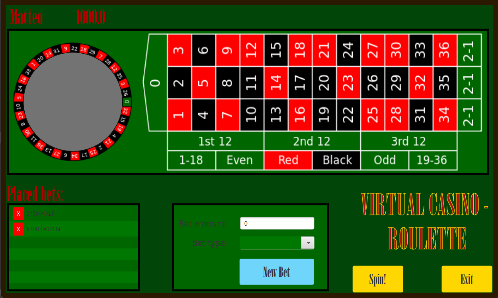

    

#
# Try your luck at Blackjack or Roulette and risk it all with dice
#
## Functionality
The minimum and mandatory features are listed below:
- *Two complete games* (Blackjack & Roulette) and *one bonus* [TODO Dice]:

    

    

- *Scoreboard* to save and see all the previous records.

- A set of automated tests for both the model and view parts.
#
#
## Optional features
- [ ] Make possible to drag and drop fiches on Roulette's table.
- [ ] Throw the dice with the mouse.
- [ ] Upgrade the scoreboard with online features.
- [ ] Stop and save the game halfway through and resume it from there.
#
#
## Division of work
- Calvanico: blackjack and main menù.
- Monti: unit test and dice.
- Ghinelli: roulette and scoreboard.