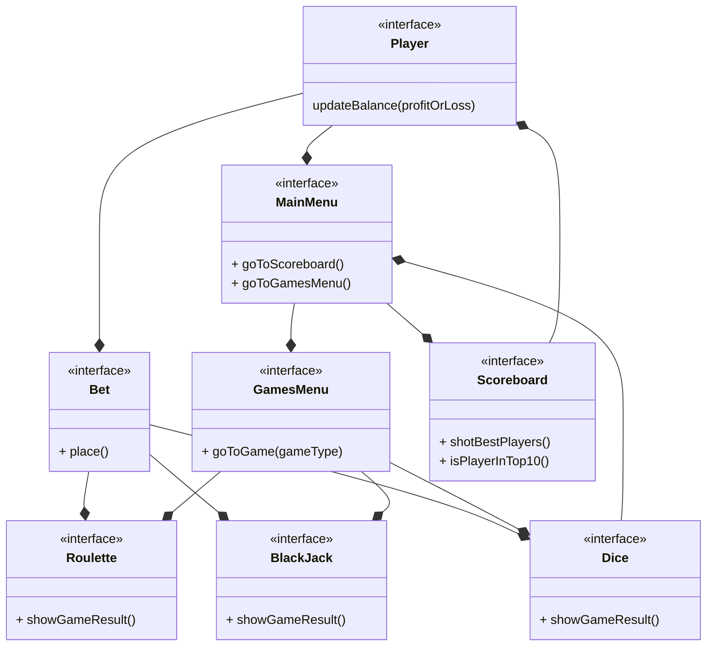
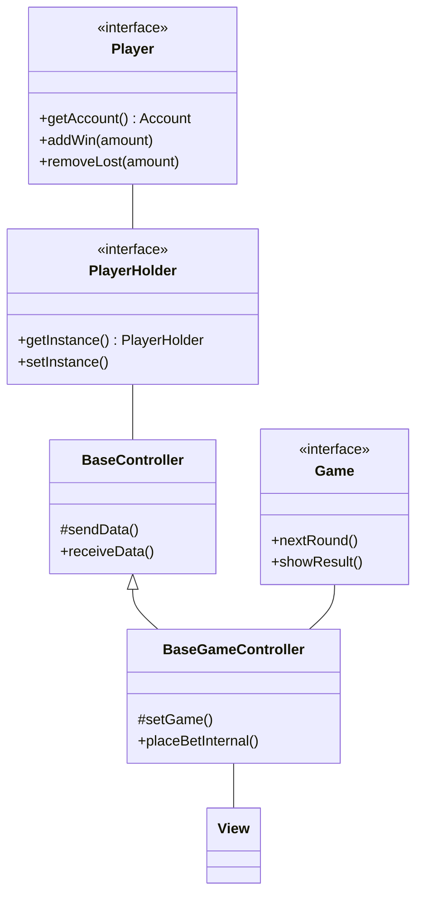
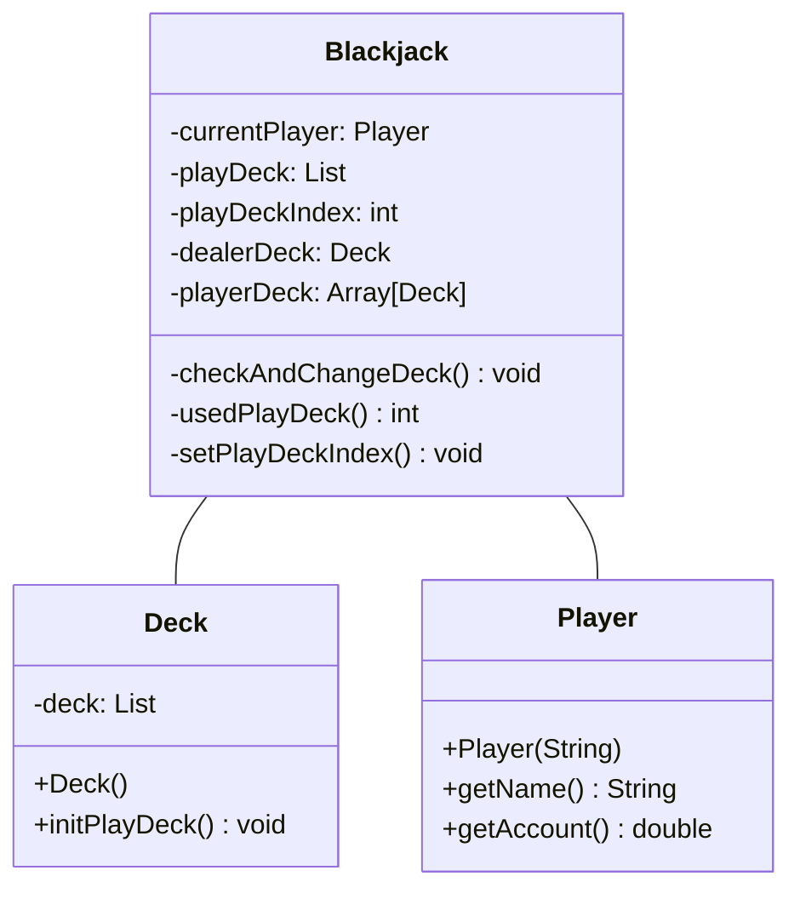
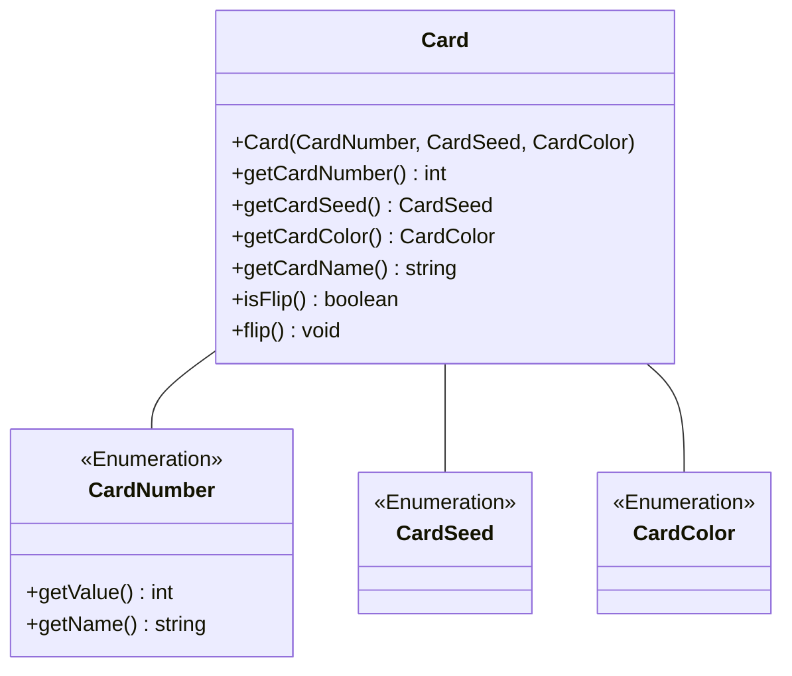
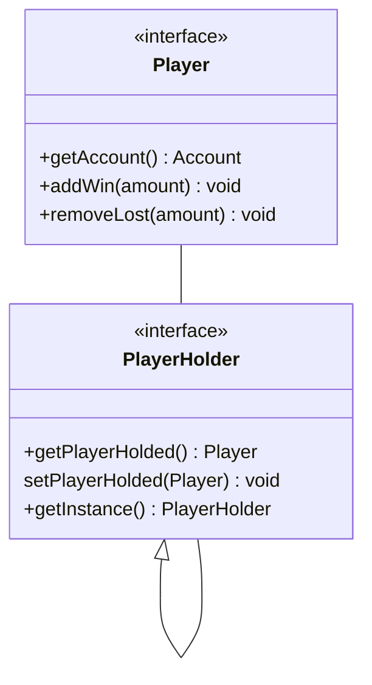
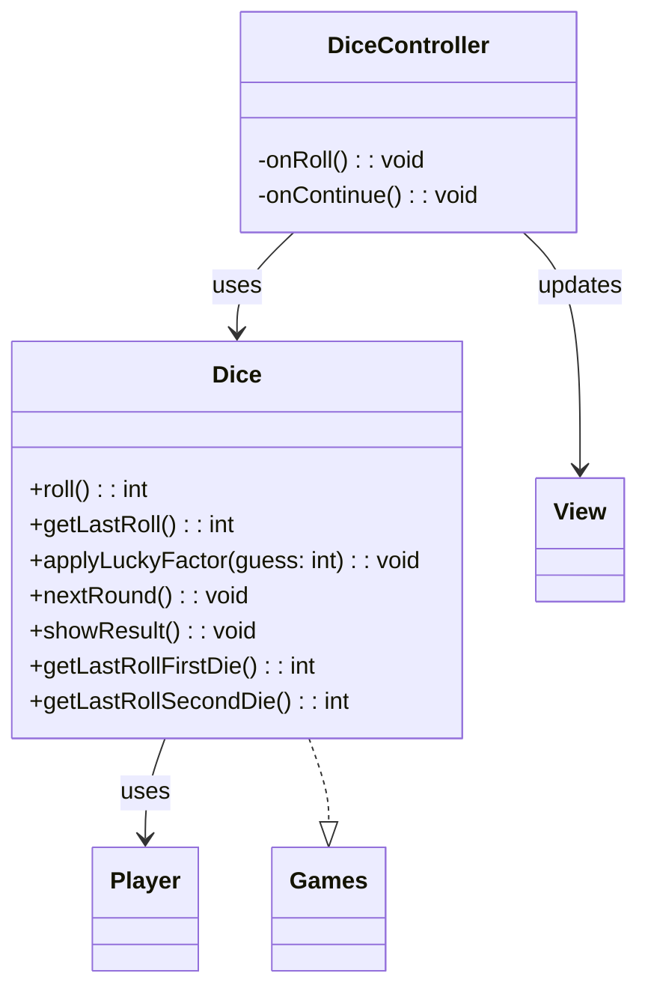
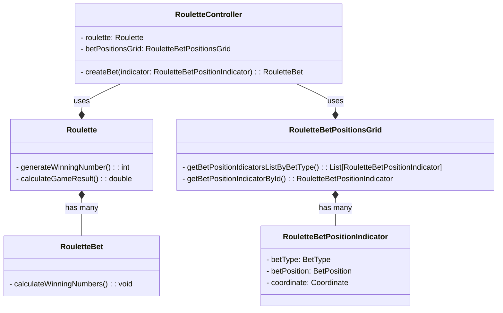
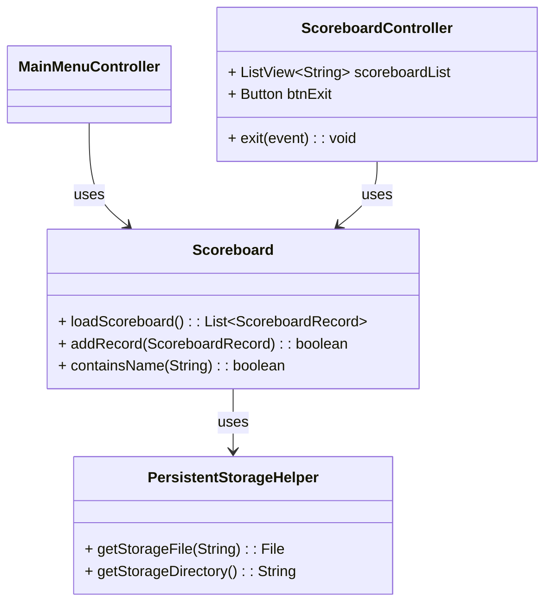
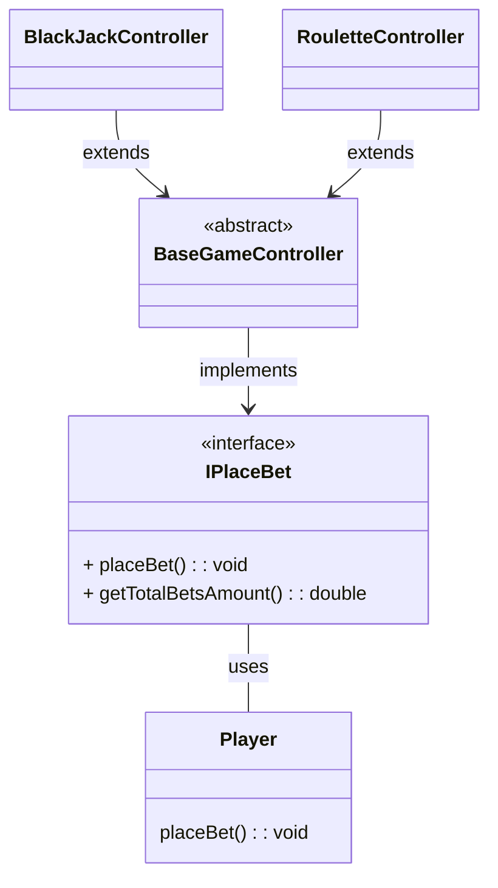

# Meta-relazione per Progettazione e Sviluppo del Software

# Analisi

Il software mette a disposizione degli utenti un Casinò virtuale in cui è possibile giocare tre grandi classici:

- BlackJack
- Roulette
- Dadi

Inoltre il casinò tiene traccia delle partite giocate dagli utenti e da la possibilità di visualizzare la classifica dei dieci migliori giocatori in base al capitale con cui sono usciti dal casinò.

I Dadi, a differenza degli altri, sono un gioco bonus che il giocatore può scegliere o meno se giocare nel momento in cui decide di uscire dal casinò.<br/>
Se il giocatore riesce ad indovinare il numero che uscirà dopo il lancio dei dadi allora il suo capitale verrà raddoppiato altrimenti, se sbaglia, verrà dimezzato.

## Requisiti funzionali

All'avvio della applicazione viene visualizzato il **menu principale**, qui è possibile decidere se iniziare a giocare o se visionare la **classifica**.

Se si entra nella **classifica** viene visualizzata una lista di record contententi nome del giocatore ed il valore del capitale con cui il giocatore è uscito dal casinò. Proprio perchè questa lista rappresenta la top 10 dei migliori giocatori, sarà limitata solamente a dieci record ed ordinata in maniera decrescente rispetto al capitale. Da qui l'utente potrà solo tornare indietro al **menu principale**.<br/>

Se dal **menu principale** si entra nel casinò viene richiessto all'utente di inserire un nome, con il quale sarà registrato ed eventualmente salvato in **classifica**. Una volta completata la registrazione viene visualizzato un secondo menu, il **menu dei giochi**, in cui è possibile scegliere tra **Roulette** e **BlackJack**.

Nella **Roulette** sarà possibile selezionare e piazzare più tipi di scommesse, eliminare le scommesse precedentemente piazzate e premere un bottone per mostrare il numero uscente.

Nel **Blackjack**, tramite interfaccia apposita, i giocatori possono ricevere carte e decidere se "restare" o richiedere carte, il banco si occupa di dare e mescolare le carte.

Ricapitolando, l'utente può fare avanti ed indietro tra il **menu dei giochi** ed i giochi stessi ma nel momento in cui dedice di uscire dal casino ha la possibilità di scegliere se giocare o meno ad il gioco dei **Dadi**.

Quello dei **Dadi** è un gioco bonus in cui il giocatore deve inserire un numero per indovinare la combinazione uscente dopo il lancio dei dadi.

Una volta giocato o meno ai **Dadi** l'utente è uscito dal casinò e si ritrova al punto di partenza, il **menu principale**

## Requisiti non funzionali

- Funzionalità drag and drop nella roulette, prendi le fiches e le trascini nelle caselle del tabellone per puntare.
- Funzionalità drag and "throw" nei dadi, sarà possibile trascinare un bicchiere che prende i dadi al suo interno, si potranno mischiare tramite movimento del cursore e al rilascio i dadi verranno lanciati.
- Classifica non più locale ma online, tramite librerie per lo scambio di messaggi in rete la classifica si aggiornerà con i nomi di tutti coloro che hanno fatto un buon punteggio anche in istanze diverse dell'applicazione.
- Salvataggio partita a metà, possibilità di mettere in pausa la partita attuale per riprenderla successivamente anche alla chiusura dell'applicazione.

## Analisi e modello del dominio

All'interno dell'applicazione l'utente (Player) dovrà potersi muoversi tra il menu pricipale, la classifica, il menu dei giochi, ed i giochi stessi.
Inoltre in ogni gioco, l'utente, sarà in grado di piazzare una o più scommesse ed ottenere il risultato del gioco



Al fine di garantire un'esperienza di gioco fluida e stabile nella prima release, abbiamo deciso di concentrarci sull'implementazione delle funzionalità core del casinò. Le interazioni avanzate come il drag and drop e le funzionalità online, pur essendo altamente desiderabili, richiederanno un ulteriore sviluppo e saranno pertanto oggetto di future iterazioni del prodotto.

# Design

## Architettura

l'architettura di **Virtual Casinò** è di tipo MVC, dove ogni componente principale ha una parte di _model_, dove c'è la logica del componente, una parte di _view_, cioè la parte visuale e con cui l'utente interagisce e per concludere la parte cardine, il controller.

Quest'ultimo è ciò che permette di collegare model e view, prendendo gli input da quest'ultima per poi passarli al model che li elabora e restituire gli output nuovamente alla view.
I macro controller sono **BaseController**, scheletro generico usato da tutti, e **BaseGameController** più specifico, utilizzato dai giochi e che estende quello precedente.
Il primo è sicuramente quello più interessante dove è presente la logica per ricevere e passare dati tra view. Per funzionare usa un _singleton_ cioè una classe già inizializzata con un'istanza che rappresenta il **Player** e permette di salvare le varie informazioni, come nome e saldo.



Nell'UML sopra viene mostrato in maniera sintetica come funziona la comunicazione tra vari componenti e l'implementazione del pattern MVC.

## Design dettagliato - Matteo Calvanico

### Blackjack Game

Rappresentazione UML **minimale** del Blackjack:



La sfida principale nell'implementazione del gioco è stata la gestione di tutti i vari mazzi (successivamente nel dettaglio la gestione delle carte). Infatti nel gioco del Blackjack i mazzi sono molteplici:

- Mazzo del banco (dealer): che rappresenta il numero da battere.
- Mazzi del giocatore: ben due, il primo è quello principale e il secondo usato in caso di _split_.
- Mazzi da gioco: i mazzi da dove si prendono le carte da assegnare, normalmente possono variare tra 2 e 6 (in base al tipo di blackjack) e quando uno finisce si cambia subito con un altro.

#### Problema

Fin da subito si è capito che il mazzo più complicato da gestire sarebbe stato quello da gioco, creato tramite una lista di **Deck**, infatti è necessario tenere conto del numero di mazzo utilizzato e, se necessario, cambiarlo prima di ogni azione per evitare di andare in eccessione.

#### Soluzione

Per far fronte a questo continuo controllo si è creato un indice, chiamato **playDeckIndex**, per tenere conto del mazzo utilizzato e un metodo, chiamato **checkAndChangeDeck**, che controlla se il mazzo è finito e in caso lo cambia, in modo da far continuare il gioco senza far notare nulla al player.

### Gestione delle carte

Rappresentazione UML della gestione delle carte



#### Problema

Gestire le varie informazioni (semi, valore, colore) delle carte in maniera pulita e riusicire a creare un mazzo equilibrato e velocemente.

#### Soluzione

Utilizzo degli Enumeratori per le informazioni, dove ognuno contiene determinati valori che sono anche iterabili, permettendo di creare in **Deck** un mazzo seguendo le regole classiche delle carte francesi e senza troppe righe di codice.

Inoltre visto la necessità di dover rappresentare lo stato della carta (Nascosta/Visibile) si è pensato di aggiungere un flag per indicare se la carta è girata o meno, accessibile tramite setter e getter.

### Condivisione informazioni Player

Rappresentazione UML del pattern Singleton per salvare e condividere le informazioni del Player tra le varie scene.



#### Problema

Riuscire a mantenere salvata l'istanza del player, in modo da gestire le varie vincite/perdite e condividere le informazioni tra le varie scene

#### Soluzione

Utilizzo del design patter _Singleton_, dove si salva il Player e si modifica utilizzando i metodi della classe singleton tramite l'istanza creata privatamente e resa disponibile tramite un metodo pubblico

## Design dettagliato – Filippo Monti

### Bonus Game – Dice

#### Problema

Alla fine dell’esperienza nel casinò, il giocatore deve poter accedere a un gioco opzionale e indipendente dagli altri: un bonus chiamato **Dadi**, in cui può tentare la fortuna scegliendo un numero tra 2 e 12, sperando che la somma di due dadi reali (valori 1–6) corrisponda alla sua previsione.

Le principali sfide sono state:

- Progettare una logica semplice ma solida che gestisca il lancio dei dadi, l’aggiornamento del saldo e la gestione degli esiti.
- Separare completamente la logica di gioco dalla UI, mantenendo il rispetto dell’architettura MVC.
- Garantire la **testabilità** dell’intera classe, permettendo di forzare i lanci di dadi in fase di test.
- Coordinare le animazioni e gli effetti visivi in modo fluido senza compromettere la logica del gioco.

#### Soluzione

La logica del gioco è stata incapsulata in una classe `Dice`, che implementa l’interfaccia `Games`, come gli altri giochi presenti nel casinò. Essa si occupa di:

- **Generare due valori casuali** tra 1 e 6, rappresentando il lancio di due dadi.
- **Calcolare la somma dei due dadi** e confrontarla con il guess dell’utente.
- **Applicare il “lucky factor” al saldo**: raddoppio in caso di successo, dimezzamento in caso di fallimento. Il metodo `applyLuckyFactor()` aggiorna il saldo usando `addWin()` o `removeLoss()` a seconda del delta.

La classe `DiceController` si occupa invece della gestione dell’interfaccia e degli eventi, in particolare:

- L’interazione con i bottoni e i campi di input (`txtGuess`, `btnRoll`, `btnContinue`).
- L’**animazione realistica del lancio dei dadi** tramite `Timeline`, con frame di shaking e immagini dei dadi aggiornate dinamicamente.
- La validazione dell’input dell’utente e il feedback immediato.
- L’aggiornamento della scoreboard alla fine della partita.

Il layout grafico è definito nel file `dice.fxml`, dove sono presenti due `ImageView` per i dadi, un campo di input per la previsione e due pulsanti per l’interazione.

#### Schema UML



### Pattern utilizzati
Strategy (variante semplificata): la classe Dice implementa l’interfaccia Games, condivisa anche da Roulette e Blackjack. Questo permette di gestire uniformemente giochi con logiche differenti, secondo un principio affine al pattern Strategy. L’interfaccia Games agisce come strategia astratta, mentre Dice, Roulette e Blackjack ne sono le implementazioni concrete.

Dependency Injection (manuale): per garantire la testabilità, Dice accetta nel costruttore un oggetto Random esterno. Questo consente di simulare scenari deterministici nei test, evitando il comportamento aleatorio dei lanci durante il testing automatico.

Separazione dei ruoli (MVC): la logica del gioco è completamente separata dall’interfaccia grafica e dalla gestione degli eventi. Dice non gestisce né suoni né immagini: tutta la parte visiva e animata è delegata a DiceController e alla view FXML.

Principio di responsabilità singola: ogni componente ha una responsabilità chiara e ben definita. Dice si occupa esclusivamente della logica di gioco e del saldo, mentre DiceController gestisce l'interazione e la transizione tra schermate.

## Design dettagliato - Giacomo Ghinelli

### Roulette Game

#### Problema

Visualizzare a schermo in maniera dinamica dei selettori che l'utente può selezionare per indicare la posizione della scommessa, evitando di scrivere in maniera hard-coded la posizione degli stessi.

Nel caso in cui il lettore non conosca il gioco della roulette è giusto specificare che le scommesse, nel gioco reale, vengono effettuate posizionando le fiches sulla tabella dei numeri. La posizione scelta indica direttamente la tipologia di scommessa, i numeri su cui si sta puntando ed il moltiplicatore in caso di vincita.

La sfida quindi è stata quella di riuscire a gestire tutti i tipi e le posizioni delle possibili scommesse che si possono fare alla roulette (ben 149 possibili scommesse diverse).

Per il gioco della roulette è stato progettato un sistema basato su tre modelli principali: **Roulette**, **RouletteBetPositionsGrid** e **RouletteBet**.

Tutti e tre questi modelli estendono una classe base contentente costanti di valori e sequenze specifiche e condivise nel gioco della roulette.

#### Soluzione

Differenziare il più possibile la logica interna del gioco, secondo il principio di singola responsabilità, introducendo le classi **RouletteBetPositionsGrid** e **RouletteBet**

1. **RouletteBetPositionsGrid** contiene la logica responsabile del calcolo dinamico delle posizioni all'interno della tabella dei numeri di tutte le possibili scommesse. Questo approccio di calcolo delle posizioni a run-time rende il software maggiormente mantenibile. Al contrario, optando per una dichiarazione hard-coded delle posizioni, nel caso in cui si fosse deciso di cambiare la dimensione della schermata dell'applicazione, si sarebbero dovute aggiornare tutte le costanti manualmente.

2. **RouletteBet** oltre a fungere da contenitore per l'ammontare ed il tipo di scommessa, contiene la logica responsabile del calcolo dei numeri vincenti. I numeri vincenti sono infatti derivati dalla posizione della scommessa all'interno della tabella dei numeri.



### Score board

#### Problema

L’applicazione richiede la gestione di una classifica persistente tra diverse esecuzioni dell'applicazione dei 10 migliori giocatori. Il saldo del giocatore deve venir salvato nel momento in cui esce dal casinò.

#### Soluzione

Classe statica **Scoreboard** che funge da servizio per il salvataggio e il recupero dei dati relativi alla scoreboard su file.

**PersistentStorageHelper**: helper generico per la gestione dei file e cartelle usate come storage. Contiente della logica che in futuro potrà essere riutilizzata da altri modelli che richiedono l'inserimento di dati in uno storage persistente.



### Interscambiabilità delle modalità con cui il player piazza scommesse nei giochi del casino.

In un casinò tutti i giochi danno la possibilità di piazzare scommesse.
L'azione di piazzare una scommessa però non è effettuata dal gioco stesso, il gioco si limita ad esporre al giocatore la modalità con cui è possibile piazzare le scommesse. Sarà poi il giocatore a controllare di aver soldi da scommettere ed effettivamente piazzare la scommessa.

Rappresentazione UML del pattarn Strategy per esporre le modalità con cui il player può scommettere.



#### Problema

Ogni gioco ha la sua specifica logica interna con cui vengono piazzate le scommesse, tale logica deve essere usata dal giocatore per piazzare le scommesse.

#### Soluzione

Il sistema per pizzare le scommesse utilizza il **pattern Strategy**. Tutti i giochi del casino, implementano l'interfaccia **IPlaceBet**, i metodi di questa interfaccia vengono poi esposti ed usati dal giocatore per piazzare le scommesse. In questo modo, il giocatore non deve conoscere la logica interna di ogni gioco per piazzare le scommesse ma è soltato a conoscenza che è possibile piazzare una scommessa su di esso.

# Sviluppo

## Testing automatizzato – Filippo Monti (core model)

### Struttura generale della suite

Il progetto è corredato da una **suite JUnit 5** che copre i package di dominio; ogni
test è headless e completamente automatico.

| Modulo         | Classi testate                                   | N. test | Focus principali                                                          |
|----------------|--------------------------------------------------|---------|---------------------------------------------------------------------------|
| **Core model** | `Player`, `Deck`, `Card`                         | 34      | Costruttori, mutatori di saldo, integrità mazzo, shuffle                  |
| **Blackjack**  | `Blackjack` (+ supporto `Deck`)                  | 24      | Call / Receive, Split, regola dealer ≥ 17, cambio mazzo run-time           |
| **Roulette**   | `Roulette`, `RouletteBet`, `RouletteBetType`     | 22      | Mappa puntate, payout, calcolo numeri vincenti, aggiornamento saldo       |
| **Dice**       | `Dice`                                           | 11      | Lancio deterministico, lucky-factor, gestione errori, reset round         |

**Totale core model:** **≈ 91 test unitari + di integrazione**  
(eseguiti in < 10 s su GitHub Actions).

---

### Tipologie di test

1. **Unit Test**  
   Verificano in isolamento singole classi (`CardTest`, `DeckTest`, …).

2. **Integration Test**  
   Simulano flussi completi di gioco  
   (es. `Blackjack`: *call → split → showResult*; `Roulette`: creazione puntata → estrazione → saldo).

3. **Edge-case & Fault Injection**  
   Uso controllato di *reflection* per riprodurre stati limite  
   (mazzi esauriti, vittoria certa in Roulette, roll non ancora effettuato in Dice).

---

### Esempi di casi notevoli

| Area                               | Tecnica                                   | Significato |
|------------------------------------|-------------------------------------------|-------------|
| **Determinismo nei Dice**          | Iniezione `new Random(42)` nel costruttore| Test ripetibile → DI (dependency injection) |
| **Cambio mazzo in Blackjack**      | Reflection → svuotamento `playDeck`       | Verifica auto-fallback su nuovo mazzo |
| **Payout massimo Roulette**        | Override di `winningNumber` con 0-36      | Copertura ramo di vincita certa      |

---

### Problemi riscontrati & soluzioni

| Problema                        | Soluzione adottata                                        |
|---------------------------------|-----------------------------------------------------------|
| Attributi chiave privati        | Reflection usata **solo nei test** + commento esplicativo |
| RNG non deterministico          | Costruttori sovraccarichi con `Random` iniettato          |
| Collezioni mutabili esposte     | Refactor → viste `Collections.unmodifiableList/Map`       |

---

### Copertura & CI

* **Jacoco line coverage**: **82 %** sul **solo** modulo `model`
  (100 % per `Dice`, > 75 % per `Blackjack` e `Roulette` – rami di log errore).
* **GitHub Actions**: job dedicato che lancia tutti i test JUnit ad ogni _push_; nessuna
  regressione dalla release finale.

Questa suite intercetta immediatamente variazioni indebite su payout, regole di
gioco o validazione degli input, garantendo stabilità al dominio logico.


---

### Test dell’interfaccia grafica (TestFX)

Per verificare la correttezza del comportamento delle view abbiamo realizzato una **seconda suite** basata su **TestFX**.  
I test risiedono nel package `it.unibo.viewTest`
e vengono eseguiti in modalità **headless**  
(TestFX + Monocle tramite `xvfb-run` nella GitHub Action).


| View / Scena                     | Classe di test          | N. test | Obiettivi principali                                                                                  |
|----------------------------------|-------------------------|---------|--------------------------------------------------------------------------------------------------------|
| **Main-menu**                    | `MainMenuViewTest`      | 4       | Smoke-load FXML, dialogo inserimento nome, routing a Games-menu, apertura Scoreboard                  |
| **Games-menu**                   | `GamesMenuViewTest`     | 8       | Visualizzazione nome/saldo, lancio Blackjack/Roulette/Dice, dialogo Exit (Yes / No / Cancel)          |
| **Blackjack**                    | `BlackjackViewTest`     | 10      | Flusso completo puntata → gioco (*Card / Stay / Split*), abilitazione pulsanti, uscita sicura         |
| **Roulette**                     | `RouletteViewTest`      | 9       | Creazione/annullo puntate, Spin ruota, update numero vincente, scommessa *RED_BLACK*, ritorno a menu  |

**Totale UI:** **31 test**.

#### Aspetti verificati

* **Smoke-load** di ogni FXML (`assertNotNull(root)`).
* **Binding di pulsanti e campi**: corretta transizione `disable / enable`.
* **Routing tra scene**: `MainMenu → GamesMenu → (Game)` e ritorno, con `WaitForAsyncUtils`.
* **Persistenza di stato** (nome giocatore, saldo) tramite `PlayerHolder`.
* **Azioni di gameplay**:
  * **Blackjack** – sequenza `+100 → Set bet → Card → Stay → Split`.
  * **Roulette** – `Bet amount 50 → RED_BLACK → click posizione → New Bet → Spin`.
* **Dialoghi / Alert** – lookup `.dialog-pane` e chiusura automatica.

#### Problemi riscontrati e workaround

| Problema                         | Work-around nei test                                 |
|---------------------------------|------------------------------------------------------|
| Animazioni / caricamento FXML   | `WaitForAsyncUtils.waitForFxEvents()` + timeout      |
| Componenti senza `fx:id`        | Aggiunta degli `fx:id` negli FXML per il lookup      |
| Pop-up modali (alert Split, Exit)| Helper `closeAnyAlert(robot)` per premere *OK*       |

#### Copertura UI

Non misuriamo la **line coverage** sulla GUI, bensì la **copertura scenari**: tutti i flussi utente principali (avvio, puntata, gioco, exit) sono ora eseguiti in modo automatico, così ogni regressione visibile viene intercettata in CI prima del rilascio.

---

## Note di sviluppo - Matteo Calvanico

### Utilizzo della libreria Media di JavaFX

**Dove**: Nella classe `it.unibo.virtualCasino.controller`, dentro al metodo _playSound_, che verrà chiamato ogni volta che bisogna far partire un suono.

**Permalink**: https://github.com/MatteoCalvanico/pss23-Calvanico-Monti-Ghinelli-VirtualCasino/blob/master/src/main/java/it/unibo/virtualCasino/controller/BaseController.java#L104

**Snippet**:

```java
protected void playSound(String soundFilePath) {
    URL resource = getClass().getResource(soundFilePath);

    if (resource == null) {
        throw new IllegalArgumentException("File path is null");
    }

    try {
        Media soundFile = new Media(resource.toString());
        MediaPlayer mediaPlayer = new MediaPlayer(soundFile);
        mediaPlayer.play();
    } catch (Exception e) {
        throw new IllegalArgumentException("Error playing sound: " + soundFilePath);
    }
}
```

### Utilizzo operatore ternario

**Dove**: in diverse classi, ad esempio: `it.unibo.virtualCasino.model.games.impl.blackjack`

**Permalink**: https://github.com/MatteoCalvanico/pss23-Calvanico-Monti-Ghinelli-VirtualCasino/blob/master/src/main/java/it/unibo/virtualCasino/model/games/impl/blackjack/Blackjack.java#L243

**Snippet**:

```java
public boolean isBlackjack() {
    return (playerDeck[0].size() == 2 && playerDeck[0].countCard() == 21) ? true : false;
    }
```

### Utilizzo Optional di java.util

**Dove**: Nella classe `it.unibo.virtualCasino.controller.menu.MainMenuController` in _showGames()_

**Permalink**: https://github.com/MatteoCalvanico/pss23-Calvanico-Monti-Ghinelli-VirtualCasino/blob/master/src/main/java/it/unibo/virtualCasino/controller/menu/MainMenuController.java#L105

**Snippet**:

```java
void showGames(ActionEvent event) {
    ...
    Optional<String> result;
    String name = "";
    boolean validName = false;

    while (!validName) {
        result = dialog.showAndWait();
        if (result.isPresent()) {
            name = result.get().trim();
            if (name.isEmpty()) {
                dialog.setHeaderText("Name cannot be empty. Please enter your name:");
            } else if (Scoreboard.containsName(name)) {
                dialog.setHeaderText("Invalid name. Name already exists on the casino scoreboard!");
            } else {
                validName = true;
            }
        } else {
            return;
        }
    }
    ...
}
```

## Note di sviluppo - Filippo Monti

### 1. Dependency Injection di `Random` (testabilità)

**Dove** `it.unibo.virtualCasino.model.games.impl.dice.Dice` – costruttore overload  

**Snippet**:

```java
public Dice(Player player, Random rng) {     // <-- Random iniettato
    this.player = player;
    this.rng = rng;
}
```
La possibilità di fornire un Random esterno rende la classe completamente
deterministica nei test (seed fissato) senza toccare la logica di produzione:
un esempio di constructor-based dependency injection minimale ma efficace.

### Animazione con Timeline + Lambda JavaFX
**Dove** `it.unibo.virtualCasino.controller.dice.DiceController` – metodo onRoll()

**Snippet**:

```java
Copia
Modifica
Timeline shake = new Timeline();
for (int i = 0; i < FRAMES; i++) {
    shake.getKeyFrames().add(
        new KeyFrame(Duration.millis(i * INTERVAL_MS), ev -> {   // ← lambda
            int f1 = ThreadLocalRandom.current().nextInt(1, 7);
            int f2 = ThreadLocalRandom.current().nextInt(1, 7);
            imgDie1.setImage(getImage("dieRed" + f1 + ".png").getImage());
            imgDie2.setImage(getImage("dieRed" + f2 + ".png").getImage());
        }));
}
shake.play();
```
Sfrutta Timeline e KeyFrame di JavaFX con una lambda expression
inline per creare un’animazione di shake dei dadi (24 frame,
80 ms di passo) senza thread espliciti né Timer.

### Aggiornamento saldo tramite delta semantics
**Dove** `Dice.applyLuckyFactor()`

**Snippet**:

```java
Copia
Modifica
double oldBalance = player.getAccount();
double newBalance = (guess == lastRoll) ? oldBalance * 2 : oldBalance / 2;

double delta = newBalance - oldBalance;
if (delta >= 0) {                // vincita → metodo semantico addWin
    player.addWin(delta);
} else {                         // perdita → metodo semantico removeLoss
    player.removeLoss(-delta);
}
```
Invece di impostare direttamente il saldo, si calcola un delta e
si delega a addWin / removeLoss, mantenendo coerenza con
l’invariante del Player (saldo ≥ 0) e centralizzando i controlli.

### Validazione input con AlertHelper e early-return
**Dove** `DiceController.onRoll()`

**Snippet**:

```java
Copia
Modifica
try {
    guess = Integer.parseInt(txtGuess.getText());
} catch (NumberFormatException ex) {
    AlertHelper.show(AlertType.WARNING, "Invalid guess",
                     "Enter a number between 2 and 12");
    return;                                   // early-return: esce subito
}
if (guess < 2 || guess > 12) {
    AlertHelper.show(AlertType.WARNING, "Invalid guess",
                     "Guess must be 2-12");
    return;
}
```
Mostra l’uso di Alert JavaFX tramite helper comune e la tecnica
dell’early-return per mantenere il metodo lineare e leggibile,
evitando rami annidati.


## Note di sviluppo - Giacomo Ghinelli

### Calcolo dinamico dei selettori di posizione delle scommesse nella tabella dei numeri.

**Dove**: Nel costruttore della classe `it.unibo.virtualCasino.model.games.impl.roulette.RouletteBetPositionsGrid`,

**Permalink**: https://github.com/MatteoCalvanico/pss23-Calvanico-Monti-Ghinelli-VirtualCasino/blob/f138e2c61eac0d5b68cfbdfb95616795a6b41817/src/main/java/it/unibo/virtualCasino/model/games/impl/roulette/RouletteBetPositionsGrid.java

Questa classe continene un'algoritmo che prende come input le coordinate degli angoli della tabella dei numeri e genera come output, per ogni possibile scommessa, la sua posizione all'interno della tabella dei numeri.

**Snippet**:

```java
public RouletteBetPositionsGrid(RouletteTableLayout tableLayout) {
    this.tableLayout = new RouletteTableLayout(tableLayout);

    this.horizontalLinesVerticalOffset = Math
            .abs(tableLayout.topLeftCoordinate.yAxisValue - tableLayout.bottomRightCoordinate.yAxisValue)
            / this.TABLE_COLS;

    this.verticalLinesHorizontalOffset = Math
            .abs(tableLayout.topLeftCoordinate.xAxisValue - tableLayout.bottomRightCoordinate.xAxisValue)
            / (this.TABLE_ROWS + 1);

    prepareBetPositionIdicatorsLayoutData();
}
```

### Utilizzo di lambda expression per il filtraggio di elementi in una lista

**Dove**: Nella classe `it.unibo.virtualCasino.model.games.impl.roulette.RouletteBetPositionsGrid`, nel metodo _getBetPositionIdicatorsListByBetType()_

**Permalink**: https://github.com/MatteoCalvanico/pss23-Calvanico-Monti-Ghinelli-VirtualCasino/blob/f138e2c61eac0d5b68cfbdfb95616795a6b41817/src/main/java/it/unibo/virtualCasino/model/games/impl/roulette/RouletteBetPositionsGrid.java

**Snippet**:

```java
public ArrayList<RouletteBetPositionIndicator> getBetPositionIdicatorsListByBetType(RouletteBetType betType) {
    ArrayList<RouletteBetPositionIndicator> listCopy = new ArrayList<>(betPositionIdicatorsList);

    listCopy.removeIf(betPositionIndicator -> betPositionIndicator.betType != betType);

    return listCopy;
}
```

### Algoritmo per il calcolo dei numeri vincenti dato il tipo e la posizione di una scommessa all'interno della tabella dei numeri nella roulette

**Dove**: Nella classe `it.unibo.virtualCasino.model.games.impl.roulette.RouletteBet`, nel metodo _getWinningNumbers(RouletteBetType betType, int betPositionInTable)_

**Permalink**: https://github.com/MatteoCalvanico/pss23-Calvanico-Monti-Ghinelli-VirtualCasino/blob/f138e2c61eac0d5b68cfbdfb95616795a6b41817/src/main/java/it/unibo/virtualCasino/model/games/impl/roulette/RouletteBet.java

**Snippet**:

```java
private ArrayList<Integer> getWinningNumbers(RouletteBetType betType, int betPositionInTable) {
    ArrayList<Integer> numbers = new ArrayList<>();
    switch (betType) {
        case STRAIGHT_UP -> numbers.add(betPositionInTable);
        case SPLIT -> {
            if (betPositionInTable < this.MAX_VERTICAL_SPLITS) {
                int topNum = calcBottomNumberBasedOnPosition(betPositionInTable);
                numbers.add(topNum + 1);
                numbers.add(topNum);
            } else {
                int bottomNum = betPositionInTable - this.MAX_VERTICAL_SPLITS + 1;
                numbers.add(bottomNum);
                numbers.add(bottomNum + this.TABLE_COLS);
            }
        }
        case STREET -> {
            int topNum = betPositionInTable * this.TABLE_COLS;
            numbers.add(topNum--);
            numbers.add(topNum--);
            numbers.add(topNum);
        }
        case CORNER -> {...}
        case DOUBLE_STREET -> {...}
        case COLUMN -> {...}
        case DOZEN -> {...}
        case ODD_EVEN -> {...}
        case RED_BLACK -> {...}
        case HALF -> {...}
        default -> {}
    }

    return numbers;
}
```

# Commenti finali

In quest'ultimo capitolo si tirano le somme del lavoro svolto e si
delineano eventuali sviluppi futuri.

**Nessuna delle informazioni incluse in questo capitolo verrà utilizzata
per formulare la valutazione finale**, a meno che non sia assente o
manchino delle sezioni obbligatorie. Al fine di evitare pregiudizi
involontari, l'intero capitolo verrà letto dai docenti solo dopo aver
formulato la valutazione.

## Autovalutazione e lavori futuri

### Matteo Calvanico

Per quanto riguarda la mia parte all'interno del progetto (Blackjack e vari menù) sono più che soddisfatto, soprattuto della parte di _Controller_ e _View_ dove credo di aver passato anche la maggior parte del tempo. Per quanto riguarda il _Model del Blackjack_, anche se sono estremamente soddisfatto, credo di poter fare alcuni miglioramenti, soprattutto perchè è stata sviluppata molto prima e con parecchi mesi di distanza dalle altre e nel mentre sono "migliorato" come sviluppatore.

Come team abbiamo lavorato molto bene insieme e credo che il carico di lavoro sia stato abbastanza equilibrato, forse solo la di Roulette (sviluppata da Giacomo) è più complicata concettualmente rispetto alle altre e quindi ha richiesto più impegno da parte sua.

Vorrei aggiungere che mi piacerebbe molto implementare altri giochi in futuro, rendendo l'applicativo simile a quello pre-installato su Windows (_Solitaire & Casual Games_). Alcune possibili aggiunte potrebbero essere Mahjong e Caravan (_Fallout: New Vegas_)

---

### Filippo Monti

---

### Giacomo Ghinelli

Per quanto possibile ho cercato di promuovere riutilizzo e condivisione del codice all'interno progetto, tramite l'uso di helper per logiche comuni ai vari componenti software.
Anche per le sezioni di cui ho curato completamente lo sviluppo ho sempre cercato di mantenere le responsabilità e le logiche il più separate possibili al fine di avere un software modulare e facilmente mentenibile. La complessita della gestione delle scommesse della roulette ha richiesto la scrittura di molta logica che per forza di cose non sarà facilmente mantenibile in futuro o per chi vede per la prima volta il codice.

Nonostante ciò penso che come team abbiamo dato tutti il massimo e per questo motivo mi ritengo estremamente soddisfatto del progetto.

## Difficoltà incontrate e commenti per i docenti

Questa sezione, **opzionale**, può essere utilizzata per segnalare ai
docenti eventuali problemi o difficoltà incontrate nel corso o nello
svolgimento del progetto, può essere vista come una seconda possibilità
di valutare il corso (dopo quella offerta dalle rilevazioni della
didattica) avendo anche conoscenza delle modalità e delle difficoltà
collegate all'esame, cosa impossibile da fare usando le valutazioni in
aula per ovvie ragioni. È possibile che alcuni dei commenti forniti
vengano utilizzati per migliorare il corso in futuro: sebbene non andrà
a vostro beneficio, potreste fare un favore ai vostri futuri colleghi.
Ovviamente **il contenuto della sezione non impatterà il voto finale**.

# Guida utente

L'utilizzo dell'applicativo è abbastanza intuitivo, all'avvio sarà possibile iniziare una nuova partita o vedere la classifica (in caso di primo avvio la classifica sarà normalmente vuota).

All'avvio di una nuova partita sarà richiesto un nome, finchè non lo si inserirà non sarà possibile continuare, successivamente vi sarannò accreditati 1000 crediti e finiti questi non sarà più possibile giocare ad altro. Se si decide di uscire sarà possibile giocare opzionalmente al bonus **Dadi** che permette di raddoppiare o azzerrare i vostri crediti in base all'esito del gioco.

Ora davanti a voi sarà presente la scelta dei giochi, di seguito le regole nel dettaglio...

## Blackjack

Per iniziare a giocare bisogna fare una puntata, è possibile puntare di 100 alla volta, e appena confermata la puntata(pulsante _Set bet_ collocato a destra) la partita inizia.

All'inizio del turno voi e il banco riceverete due carte (nel suo caso una è girata), il vostro scopo è fare più del banco ma senza superare il 21, se fate 21 con le prime due carte vincete automaticamente (il cosidetto **blackjack**).

Durante il gioco avete a disposizione tre pulsanti:

- _Split_: se avete due carte uguali potete spostarne una nel secondo mazzo a se stante, quindi non importa quanto fate nell'altro, e come fare due partite contemporaneamente con due puntate uguali.
- _+_: come potete immaginare serve per riceve una carta nel mazzo corrispondente...attenzione a non chiederne troppe.
- _Stay_: anche qui abbastanza esplicativo, fa capire al dealer che non si vogliono più carte, può voler dire fine del turno e quindi mostrare i risultati.

Si può uscire in qualsiasi momento (tranne quando è in corso un turno) dal comodo pulsante _Exit_ posto a destra sotto la sezione delle scommesse.

## Roulette

**Obiettivo del Gioco** : Punta su uno o più numeri o combinazioni, premi **Spin!**, e scopri se hai indovinato il numero vincente!

- **Piazza una scommessa**:

  - Scrivi quanto vuoi scommettere nel campo **Bet amount**.
  - Seleziona dal menu a tendina il tipo di scommessa: `STRAIGHT_UP` (un numero singolo) `SPLIT`, `CORNER`, ecc. (in base alle opzioni disponibili)
  - In base al tipo selezionato, il gioco proporrà degli indicatori sulla tavola dei numeri, usando questi indicatori seleziona la posizione della scommessa.
  - Clicca su **New Bet**

- **Controlla le puntate piazzate**

  - Nella sezione **Placed bets**, vedi l’elenco delle puntate attive
  - Puoi annullarle cliccando sul pulsante rosso **X**

- **Gira la ruota**

  - Clicca sul pulsante **Spin!**
  - Il numero vincente apparirà al centro della ruota (in giallo)
  - Il tuo saldo si aggiornerà in base al risultato

- **Fine o nuovo giro**

  - Continua a giocare usando oppure esci dal gioco premendo **Exit**

- **Consigli**
  - Puoi piazzare più puntate prima di girare
  - Il gioco non permette di scommettere più di quanto possiedi

## Dadi
