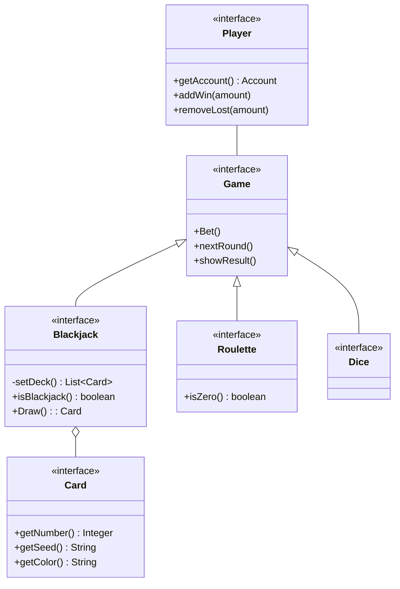
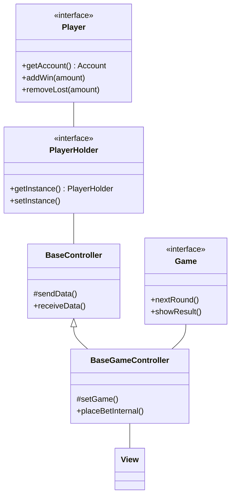
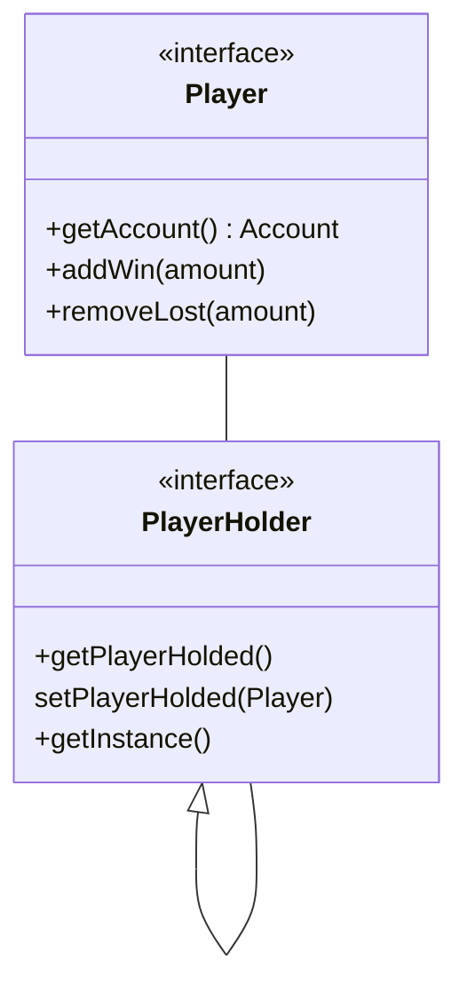

# Meta-relazione per Progettazione e Sviluppo del Software

# Analisi

## Requisiti

Il gruppo si pone come obiettivo la realizzazione di un Casinò simulato con diversi giochi e classifiche.

In modo da dare il brivido del gioco senza la paura di perdere vero capitale, infatti il giocatore potrà giocare liberamente finchè il suo credito sarà positivo (>0) e appena andrà in rosso verrà espulso.
Il casinò da la possibilità di terminare la partita in maniera definitiva ed entrare in classifica (se il punteggio sarà abbastanza grande) ma prima di inserire il proprio punteggio il giocatore potrà scegliere se tentare la fortuna ai dadi, dove il profitto verrà raddoppiato o dimezzato in base al risultato del gioco.

#### Requisiti funzionali
- Menù principale: schermata che verrà mostrata all'avvio del software, qui sarà possibile decidere se iniziare a giocare inserendo il proprio nome o se visionare la classifica;
- Realizzazione simulata di giochi da banco, nello specifico:
    - Blackjack: tramite interfaccia apposita i giocatori potranno ricevere carte e decidere se "restare" o richiedere carte, il banco si occuperà di dare e mescolare le carte;
    - Roulette: tramite tabellone sarà possibile fare le proprie puntate e aspettare il verdetto controllando la roulette;
    - Dadi [gioco bonus]: opzione bonus e facoltativa che si attiva alla decisione dell'utente di terminare la sessione di gioco per salvare il proprio punteggio, il giocatore dovrà inserire un numero cercando di indovinare la combinazione dei dadi;
- Organizzazione vincite tramite classifica: i records rappresenteranno nome e profitto.

#### Requisiti non funzionali

- Funzionalità drag and drop nella roulette, prendi le fiches e le trascini nelle caselle del tabellone per puntare.
- Funzionalità drag and "throw" nei dadi, sarà possibile trascinare un bicchiere che prende i dadi al suo interno, si potranno mischiare tramite   movimento del cursore e al rilascio i dadi verranno lanciati.
- Classifica non più locale ma online, tramite librerie per lo scambio di messaggi in rete la classifica si aggiornerà con i nomi di tutti coloro che hanno fatto un buon punteggio anche in istanze diverse dell'applicazione.
- Salvataggio partita a metà, possibilità di mettere in pausa la partita attuale per riprenderla successivamente anche alla chiusura dell'applicazione.

## Analisi e modello del dominio

All'interno dell'applicazione esistono diverse entità ma la principale è sicuramente **Player** che potrà scegliere di divertirsi nei vari **Game** divisi in **Blackjack**, **Roulette** e **Dice**; dove per ogni gioco sarà possibile scommettere.
**Dice** essendo un bonus si attiverà solo qunando l'utente deciderà di smettere di giocare.
Nel **Blackjack** il mazzo sarà composto da un'insieme di **Card** caratterizzate da seme, numero e colore.




# Design
## Architettura
l'architettura di **Virtual Casinò** è di tipo MVC, dove ogni componente principale ha una parte di *model*, dove c'è la logica del componente, una parte di *view*, cioè la parte visuale e con cui l'utente interagisce e per concludere la parte cardine, il controller.

Quest'ultimo è ciò che permette di collegare model e view, prendendo gli input da quest'ultima per poi passarli al model che li elabora e restituire gli output nuovamente alla view.
I macro controller sono **BaseController**, scheletro generico usato da tutti, e **BaseGameController** più specifico, utilizzato dai giochi e che estende quello precedente.
Il primo è sicuramente quello più interessante dove è presente la logica, usata da tutti, per ricevere e passare dati tra view, per funzionare usa un *singleton* cioè una classe già inizializzata con un'istanza che rappresenta il **Player** e permette di salvare le varie informazioni, come nome e saldo.


Nell'UML sopra viene mostrato in maniera sintetica come funziona la comunicazione tra vari componenti e l'implementazione del pattern MVC.

## Design dettagliato - Matteo Calvanico
### Condivisione informazioni Player
Rappresentazione UML del pattern Singleton per salvare e condividere le informazioni del Player tra le varie scene.


#### Problema
Riuscire a mantenere salvata l'istanza del player, in modo da gestire le varie vincite/perdite e condividere le informazioni tra le varie scene

#### Soluzione
Utilizzo del design patter *Singleton*, dove si salva il Player e si modifica utilizzando i metodi della classe singleton tramite l'istanza creata privatamente e resa disponibile tramite un metodo pubblico

### Gestione delle carte
Rappresentazione UML della gestione delle carte

```mermaid
class Card {
    +Card(CardNumber, CardSeed, CardColor)
    +getCardNumber() int
    +getCardSeed() CardSeed
    +getCardColor() CardColor
    +getCardName() string
}

class CardNumber{
    +getValue() int
    +getName() string
}
<<Enumeration>> CardNumber

class CardSeed
<<Enumeration>> CardSeed

class CardColor
<<Enumeration>> CardColor

Card -- CardNumber
Card -- CardSeed
Card -- CardColor
```

#### Problema
Gestire le varie informazioni (semi, valore, colore) delle carte in maniera pulita e riusicire a creare un mazzo equilibrato e velocemente.

#### Soluzione
Utilizzo degli Enumeratori per le informazioni, dove ognuno contiene determinati valori che sono anche iterabili, permettendo di creare in **Deck** un mazzo seguendo le regole classiche delle carte francesi e senza troppe righe di codice 

## Design dettagliato - Filippo Monti

## Design dettagliato - Giacomo Ghinelli

# Sviluppo

## Testing automatizzato

Il testing automatizzato è un requisito di qualunque progetto software
che si rispetti, e consente di verificare che non vi siano regressioni
nelle funzionalità a fronte di aggiornamenti.
Per quanto riguarda questo
progetto è considerato sufficiente un test minimale, a patto che sia
completamente automatico. Test che richiedono l'intervento da parte
dell'utente sono considerati *negativamente* nel computo del punteggio
finale.

### Elementi positivi

-   Si descrivono molto brevemente i componenti che si è deciso di
    sottoporre a test automatizzato.
-   Si utilizzano suite specifiche (e.g. JUnit) per il testing
    automatico.

### Elementi negativi {#elementi-negativi-4 .unnumbered}

-   Non si realizza alcun test automatico.
-   La non presenza di testing viene aggravata dall'adduzione di
    motivazioni non valide. Ad esempio, si scrive che l'interfaccia
    grafica non è testata automaticamente perché è *impossibile*
    farlo (testare in modo automatico le interfacce grafiche è possibile, si veda, come esempio,
    [TestFX](https://github.com/TestFX/TestFX);
    semplicemente, nel corso non c'è modo e tempo di introdurvi questo
    livello di complessità).
-   Si descrive un testing di tipo manuale in maniera prolissa.
-   Si descrivono test effettuati manualmente che sarebbero potuti
    essere automatizzati, ad esempio scrivendo che si è usata
    l'applicazione manualmente.
-   Si descrivono test non presenti nei sorgenti del progetto.
-   I test, quando eseguiti, falliscono.

## Note di sviluppo

Questa sezione, come quella riguardante il design dettagliato va svolta
**singolarmente da ogni membro del gruppo**.

Ciascuno dovrà mettere in
evidenza da un minimo di 3 ad un massimo di 5 punti in cui ritiene di aver scritto codice particolarmente ben congegnato,
ad esempio perché sfrutta una libreria o feature avanzata non vista a lezione,
oppure perché usa costrutti del linguaggio avanzati.

Ciascun elemento deve presentare:
1. Nome del sorgente dove reperirlo, a scelta uno fra:
   * nome qualificato della classe
   * percorso del file
   * permalink GitHub
2. Uno snippet con il codice cui ci si riferisce
3. Una *brevissima* descrizione della feature avanzata che si vuole mostrare.

Esempi di feature interessanti potrebbero essere:
- Progettazione con generici, ad esempio costruzione di nuovi tipi
  generici, e uso di generici bounded.
- Uso di lambda expressions
- Uso di `Stream`, di `Optional` o di altri costrutti funzionali
- Uso della reflection
- Definizione ed uso di nuove annotazioni
- Uso del Java Platform Module System
- Uso di parti della libreria JDK non spiegate a lezione
  (networking, compressione, parsing XML, eccetera)
- Uso di librerie di terze parti: JavaFX, Google Guava, Apache Commons...
- Sviluppo di algoritmi particolarmente interessanti
  *non forniti da alcuna libreria*
  (spesso può convenirvi chiedere sul forum se ci sia
  una libreria per fare una certa cosa, prima di gettarvi a capofitto
  per scriverla voi stessi).

In questa sezione, *dopo l'elenco*, vanno menzionati ed attributi con
precisione eventuali pezzi di codice "riadattati" (o scopiazzati...) da
Internet o da altri progetti, pratica che tolleriamo ma che non
raccomandiamo.
Si rammenta agli studenti che non è consentito partire da
progetti esistenti e procedere per modifiche successive.
Si ricorda
anche che i docenti hanno in mano strumenti antiplagio piuttosto
raffinati e che "capiscono" il codice e la storia delle modifiche del
progetto, per cui tecniche banali come cambiare nomi (di classi, metodi,
campi, parametri, o variabili locali), aggiungere o togliere commenti,
oppure riordinare i membri di una classe vengono individuate senza
problemi.
Le regole del progetto spiegano in dettaglio l'approccio dei
docenti verso atti gravi come il plagiarismo.

I pattern di design **non** vanno messi qui. L'uso di pattern di design
(come suggerisce il nome) è un aspetto avanzato di design, non di
implementazione, e non va in questa sezione.

### Elementi positivi

- Ogni studente ha almeno 3 sottosezioni con snippet e descrizione
- Nessuno studente ha più di 5 sottosezioni con snippet e descrizione
- Si identificano parti di codice prese da altri progetti, dal web, o
comunque scritte in forma originale da altre persone. In tal senso,
si ricorda che agli ingegneri non è richiesto di re-inventare la
ruota continuamente: se si cita debitamente la sorgente è tollerato
fare uso di di snippet di codice open source per risolvere
velocemente problemi non banali. Nel caso in cui si usino snippet di
codice di qualità discutibile, oltre a menzionarne l'autore
originale si invitano gli studenti ad adeguare tali parti di codice
agli standard e allo stile del progetto. Contestualmente, si fa
presente che è largamente meglio fare uso di una libreria che
copiarsi pezzi di codice: qualora vi sia scelta (e tipicamente c'è),
si preferisca la prima via.

### Elementi negativi
- Si elencano applicazioni di terze parti
  (peggio se per usarle occorre licenza, e lo studente ne è sprovvisto)
  che non c'entrano nulla con lo sviluppo, ad esempio:
    -   Editor di grafica vettoriale come Inkscape o Adobe Illustrator;
    -   Editor di grafica scalare come GIMP o Adobe Photoshop;
    -   Editor di audio come Audacity;
    -   Strumenti di design dell'interfaccia grafica come SceneBuilder:
        il codice è in ogni caso inteso come sviluppato da voi.
- Si descrivono aspetti di scarsa rilevanza, o si scende in dettagli inutili.
- Sono presenti parti di codice sviluppate originalmente da altri che
non vengono debitamente segnalate. In tal senso, si ricorda agli
studenti che i docenti hanno accesso a tutti i progetti degli anni
passati, a Stack Overflow, ai principali blog di sviluppatori ed
esperti Java, ai blog dedicati allo sviluppo di soluzioni e
applicazioni (inclusi blog dedicati ad Android e allo sviluppo di
videogame), nonché ai vari GitHub, GitLab, e Bitbucket.
Conseguentemente, è *molto* conveniente *citare* una fonte ed usarla
invece di tentare di spacciare per proprio il lavoro di altri.
- Si elencano design pattern

### Esempio

#### Utilizzo della libreria SLF4J

**Dove**: diverse classi, ad esempio `it.unibo.alchemist.boundary.swingui.effect.impl.EffectBuilder`

**Permalink**: https://github.com/AlchemistSimulator/Alchemist/blob/5c17f8b76920c78d955d478864ac1f11508ed9ad/alchemist-swingui/src/main/java/it/unibo/alchemist/boundary/swingui/effect/impl/EffectBuilder.java#L49

**Snippet**

```java
    private static final Logger L = LoggerFactory.getLogger(EffectBuilder.class);
...
        try {
            barrier.await();
        } catch (final InterruptedException e) {
            L.error("Bug in " + getClass(), e);
        }
...
}
```

#### Utilizzo della `LoadingCache` di Google Guava

**Dove**: `it.unibo.alchemist.protelis.AlchemistExecutionContext`

**Permalink**: https://github.com/AlchemistSimulator/Alchemist/blob/d8a1799027d7d685569e15316a32e6394632ce71/alchemist-incarnation-protelis/src/main/java/it/unibo/alchemist/protelis/AlchemistExecutionContext.java#L63-L79

**Snippet**

```java
private final LoadingCache<P, Double> cache = CacheBuilder.newBuilder()
    .expireAfterAccess(10, TimeUnit.MINUTES)
    .maximumSize(100)
    .build(new CacheLoader<>() {
        @Nonnull
        @Override
        public Double load(@Nonnull final P dest) {
        if (environment instanceof MapEnvironment) {
            if (dest instanceof GeoPosition) {
                return ((MapEnvironment<Object, ?, ?>) environment).computeRoute(node, (GeoPosition) dest).length();
            } else {
                throw new IllegalStateException("Illegal position type: " + dest.getClass() + " " + dest);
            }
        }
        return getDevicePosition().distanceTo(dest);
    }
});
```

#### Scrittura di metodo generico con parametri contravarianti

**Dove**: `it.unibo.alchemist.protelis.AlchemistExecutionContext`

**Permalink**: https://github.com/AlchemistSimulator/Alchemist/blob/d8a1799027d7d685569e15316a32e6394632ce71/alchemist-incarnation-protelis/src/main/java/it/unibo/alchemist/protelis/AlchemistExecutionContext.java#L141-L143

**Snippet**
```java
private <X> Field<X> buildFieldWithPosition(final Function<? super P, X> fun) {
    return buildField(fun, getDevicePosition());
}
```

#### Utilizzo della libreria `Stream` e di lambda expressions

**Dove**: molte classi, ad esempio `it.unibo.alchemist.model.ProtelisIncarnation`

**Permalink**: https://github.com/AlchemistSimulator/Alchemist/blob/d8a1799027d7d685569e15316a32e6394632ce71/alchemist-incarnation-protelis/src/main/java/it/unibo/alchemist/model/ProtelisIncarnation.java#L98-L120

**Snippet**
```java
@Nonnull
private static List<RunProtelisProgram<?>> getIncomplete(
    final Node<?> protelisNode,
    final List<RunProtelisProgram<?>> alreadyDone
) {
    return protelisNode.getReactions().stream()
        /*
        * Get the actions
        */
        .flatMap(r -> r.getActions().stream())
        /*
        * Get only the ProtelisPrograms
        */
        .filter(a -> a instanceof RunProtelisProgram)
        .map(a -> (RunProtelisProgram<?>) a)
        /*
        * Retain only those ProtelisPrograms that have no associated ComputationalRoundComplete.
        *
        * Only one should be available.
        */
        .filter(prog -> !alreadyDone.contains(prog))
        .collect(Collectors.toList());
}
```

#### Protezione da corse critiche usando `Semaphore`

**Dove**: `it.unibo.alchemist.model.ProtelisIncarnation.DummyContext`

**Permalink**: https://github.com/AlchemistSimulator/Alchemist/blob/d8a1799027d7d685569e15316a32e6394632ce71/alchemist-incarnation-protelis/src/main/java/it/unibo/alchemist/model/ProtelisIncarnation.java#L388-L440

**Snippet**

```java
private static final Semaphore MUTEX = new Semaphore(1);
private static final int SEED = -241_837_578;
private static final RandomGenerator RNG = new MersenneTwister(SEED);
...
@Override
public double nextRandomDouble() {
    final double result;
    MUTEX.acquireUninterruptibly();
    result = RNG.nextDouble();
    MUTEX.release();
    return result;
}
```

# Commenti finali

In quest'ultimo capitolo si tirano le somme del lavoro svolto e si
delineano eventuali sviluppi futuri.

**Nessuna delle informazioni incluse in questo capitolo verrà utilizzata
per formulare la valutazione finale**, a meno che non sia assente o
manchino delle sezioni obbligatorie. Al fine di evitare pregiudizi
involontari, l'intero capitolo verrà letto dai docenti solo dopo aver
formulato la valutazione.

## Autovalutazione e lavori futuri

**È richiesta una sezione per ciascun membro del gruppo,
obbligatoriamente**.

Ciascuno dovrà autovalutare il proprio lavoro,
elencando i punti di forza e di debolezza in quanto prodotto. Si dovrà
anche cercare di descrivere *in modo quanto più obiettivo possibile* il
proprio ruolo all'interno del gruppo. Si ricorda, a tal proposito, che
ciascuno studente è responsabile solo della propria sezione: non è un
problema se ci sono opinioni contrastanti, a patto che rispecchino
effettivamente l'opinione di chi le scrive.

## Difficoltà incontrate e commenti per i docenti

Questa sezione, **opzionale**, può essere utilizzata per segnalare ai
docenti eventuali problemi o difficoltà incontrate nel corso o nello
svolgimento del progetto, può essere vista come una seconda possibilità
di valutare il corso (dopo quella offerta dalle rilevazioni della
didattica) avendo anche conoscenza delle modalità e delle difficoltà
collegate all'esame, cosa impossibile da fare usando le valutazioni in
aula per ovvie ragioni. È possibile che alcuni dei commenti forniti
vengano utilizzati per migliorare il corso in futuro: sebbene non andrà
a vostro beneficio, potreste fare un favore ai vostri futuri colleghi.
Ovviamente **il contenuto della sezione non impatterà il voto finale**.

# Guida utente

Capitolo in cui si spiega come utilizzare il software. Nel caso in cui
il suo uso sia del tutto banale, tale capitolo può essere omesso. A tal
riguardo, si fa presente agli studenti che i docenti non hanno mai
utilizzato il software prima, per cui aspetti che sembrano del tutto
banali a chi ha sviluppato l'applicazione possono non esserlo per chi la
usa per la prima volta. Se, ad esempio, per cominciare una partita con
un videogioco è necessario premere la barra spaziatrice, o il tasto "P",
è necessario che gli studenti lo segnalino.

### Elementi positivi

-   Si istruisce in modo semplice l'utente sull'uso dell'applicazione,
    eventualmente facendo uso di schermate e descrizioni.

### Elementi negativi

-   Si descrivono in modo eccessivamente minuzioso tutte le
    caratteristiche, anche minori, del software in oggetto.
-   Manca una descrizione che consenta ad un utente qualunque di
    utilizzare almeno le funzionalità primarie dell'applicativo.
