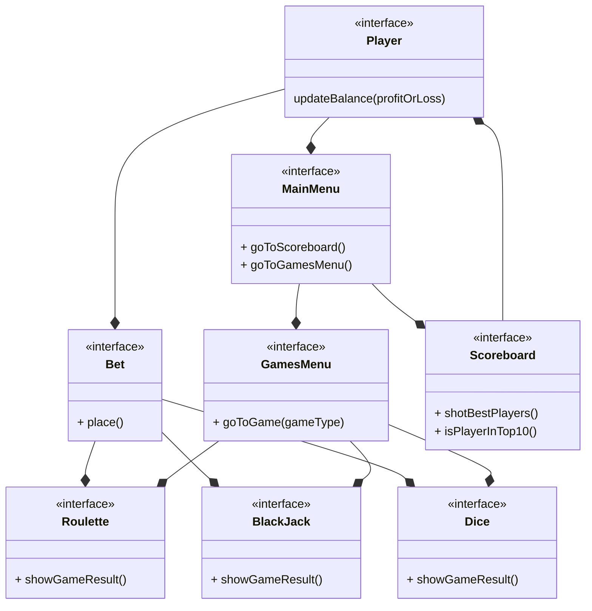
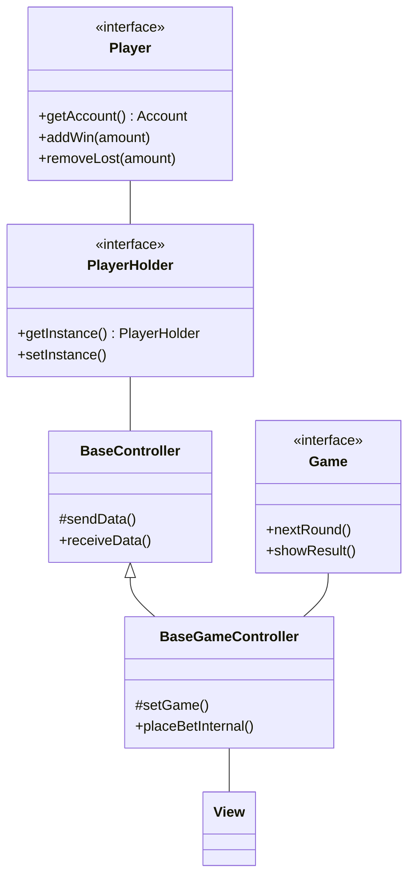
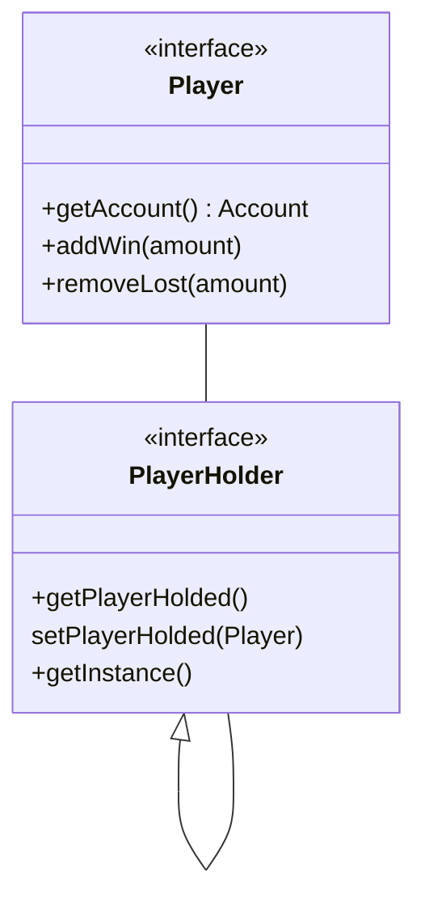
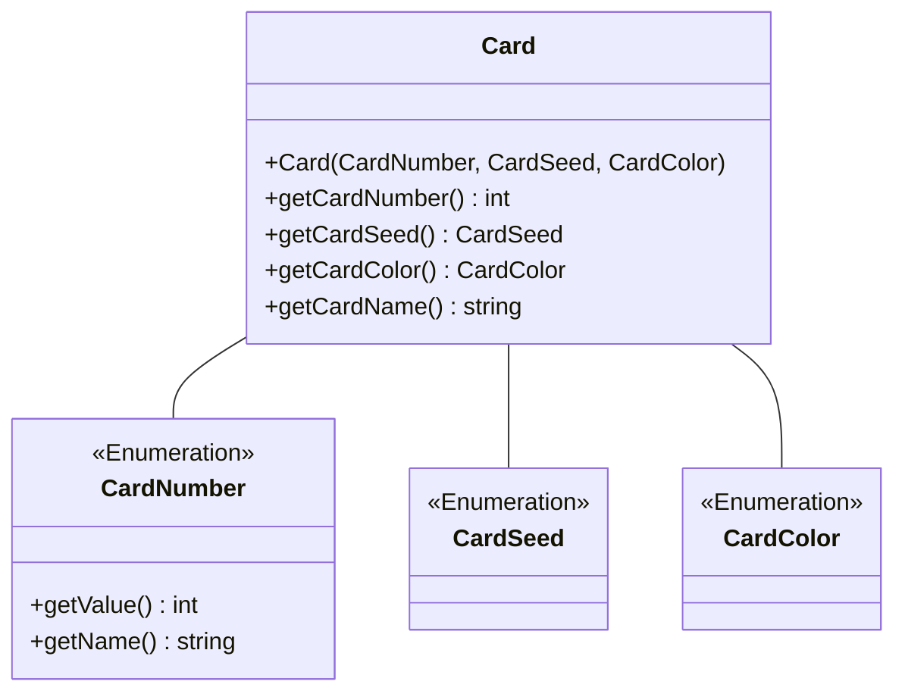

# Meta-relazione per Progettazione e Sviluppo del Software

# Analisi

Il software mette a disposizione degli utenti un Casinò virtuale in cui è possibile giocare tre grandi classici:

- BlackJack
- Roulette
- Dadi

Inoltre il casinò tiene traccia delle partite giocate dagli utenti e da la possibilità di visualizzare la classifica dei dieci migliori giocatori in base al capitale con cui sono usciti dal casinò.

I Dadi, a differenza degli altri, sono un gioco bonus che il giocatore può scegliere o meno se giocare nel momento in cui decide di uscire dal casinò.<br/>
Se il giocatore riesce ad indovinare il numero che uscirà dopo il lancio dei dadi allora il suo capitale verrà raddoppiato altrimenti, se sbaglia, verrà dimezzato.

## Requisiti funzionali

All'avvio della applicazione viene visualizzato il **menu principale**, qui è possibile decidere se iniziare a giocare o se visionare la **classifica**.

Se si entra nella **classifica** viene visualizzata una lista di record contententi nome del giocatore ed il valore del capitale con cui il giocatore è uscito dal casinò. Proprio perchè questa lista rappresenta la top 10 dei migliori giocatori, sarà limitata solamente a dieci record ed ordinata in maniera decrescente rispetto al capitale. Da qui l'utente potrà solo tornare indietro al **menu principale**.<br/>

Se dal **menu principale** si entra nel casinò viene richiessto all'utente di inserire un nome, con il quale sarà registrato ed eventualmente salvato in **classifica**. Una volta completata la registrazione viene visualizzato un secondo menu, il **menu dei giochi**, in cui è possibile scegliere tra **Roulette** e **BlackJack**.

Nella **Roulette** sarà possibile selezionare e piazzare più tipi di scommesse, eliminare le scommesse precedentemente piazzate e premere un bottone per mostrare il numero uscente.

Nel **Blackjack**, tramite interfaccia apposita, i giocatori possono ricevere carte e decidere se "restare" o richiedere carte, il banco si occupa di dare e mescolare le carte.

Ricapitolando, l'utente può fare avanti ed indietro tra il **menu dei giochi** ed i giochi stessi ma nel momento in cui dedice di uscire dal casino ha la possibilità di scegliere se giocare o meno ad il gioco dei **Dadi**.

Quello dei **Dadi** è un gioco bonus in cui il giocatore deve inserire un numero per indovinare la combinazione uscente dopo il lancio dei dadi.

Una volta giocato o meno ad i **Dadi** l'utente è uscito dal casinò e si ritrova al punto di partenza, il **menu principale**

## Requisiti non funzionali

- Funzionalità drag and drop nella roulette, prendi le fiches e le trascini nelle caselle del tabellone per puntare.
- Funzionalità drag and "throw" nei dadi, sarà possibile trascinare un bicchiere che prende i dadi al suo interno, si potranno mischiare tramite movimento del cursore e al rilascio i dadi verranno lanciati.
- Classifica non più locale ma online, tramite librerie per lo scambio di messaggi in rete la classifica si aggiornerà con i nomi di tutti coloro che hanno fatto un buon punteggio anche in istanze diverse dell'applicazione.
- Salvataggio partita a metà, possibilità di mettere in pausa la partita attuale per riprenderla successivamente anche alla chiusura dell'applicazione.

## Analisi e modello del dominio

All'interno dell'applicazione l'utente (Player) dovrà potersi muoversi tra il menu pricipale, la classifica, il menu dei giochi, ed i giochi stessi.
Inoltre in ogni gioco, l'utente, sarà in grado di piazzare una o più scommesse ed ottenere il risultato del gioco



Al fine di garantire un'esperienza di gioco fluida e stabile nella prima release, abbiamo deciso di concentrarci sull'implementazione delle funzionalità core del casinò. Le interazioni avanzate come il drag and drop e le funzionalità online, pur essendo altamente desiderabili, richiederanno un ulteriore sviluppo e saranno pertanto oggetto di future iterazioni del prodotto.

# Design

## Architettura

l'architettura di **Virtual Casinò** è di tipo MVC, dove ogni componente principale ha una parte di _model_, dove c'è la logica del componente, una parte di _view_, cioè la parte visuale e con cui l'utente interagisce e per concludere la parte cardine, il controller.

Quest'ultimo è ciò che permette di collegare model e view, prendendo gli input da quest'ultima per poi passarli al model che li elabora e restituire gli output nuovamente alla view.
I macro controller sono **BaseController**, scheletro generico usato da tutti, e **BaseGameController** più specifico, utilizzato dai giochi e che estende quello precedente.
Il primo è sicuramente quello più interessante dove è presente la logica, usata da tutti, per ricevere e passare dati tra view, per funzionare usa un _singleton_ cioè una classe già inizializzata con un'istanza che rappresenta il **Player** e permette di salvare le varie informazioni, come nome e saldo.



Nell'UML sopra viene mostrato in maniera sintetica come funziona la comunicazione tra vari componenti e l'implementazione del pattern MVC.

## Design dettagliato - Matteo Calvanico

### Condivisione informazioni Player

Rappresentazione UML del pattern Singleton per salvare e condividere le informazioni del Player tra le varie scene.



#### Problema

Riuscire a mantenere salvata l'istanza del player, in modo da gestire le varie vincite/perdite e condividere le informazioni tra le varie scene

#### Soluzione

Utilizzo del design patter _Singleton_, dove si salva il Player e si modifica utilizzando i metodi della classe singleton tramite l'istanza creata privatamente e resa disponibile tramite un metodo pubblico

### Gestione delle carte

Rappresentazione UML della gestione delle carte



#### Problema

Gestire le varie informazioni (semi, valore, colore) delle carte in maniera pulita e riusicire a creare un mazzo equilibrato e velocemente.

#### Soluzione

Utilizzo degli Enumeratori per le informazioni, dove ognuno contiene determinati valori che sono anche iterabili, permettendo di creare in **Deck** un mazzo seguendo le regole classiche delle carte francesi e senza troppe righe di codice

## Design dettagliato - Filippo Monti

## Design dettagliato - Giacomo Ghinelli

# Sviluppo

## Testing automatizzato

Il testing automatizzato è un requisito di qualunque progetto software
che si rispetti, e consente di verificare che non vi siano regressioni
nelle funzionalità a fronte di aggiornamenti.
Per quanto riguarda questo
progetto è considerato sufficiente un test minimale, a patto che sia
completamente automatico. Test che richiedono l'intervento da parte
dell'utente sono considerati _negativamente_ nel computo del punteggio
finale.

### Elementi positivi

- Si descrivono molto brevemente i componenti che si è deciso di
  sottoporre a test automatizzato.
- Si utilizzano suite specifiche (e.g. JUnit) per il testing
  automatico.

### Elementi negativi {#elementi-negativi-4 .unnumbered}

- Non si realizza alcun test automatico.
- La non presenza di testing viene aggravata dall'adduzione di
  motivazioni non valide. Ad esempio, si scrive che l'interfaccia
  grafica non è testata automaticamente perché è _impossibile_
  farlo (testare in modo automatico le interfacce grafiche è possibile, si veda, come esempio,
  [TestFX](https://github.com/TestFX/TestFX);
  semplicemente, nel corso non c'è modo e tempo di introdurvi questo
  livello di complessità).
- Si descrive un testing di tipo manuale in maniera prolissa.
- Si descrivono test effettuati manualmente che sarebbero potuti
  essere automatizzati, ad esempio scrivendo che si è usata
  l'applicazione manualmente.
- Si descrivono test non presenti nei sorgenti del progetto.
- I test, quando eseguiti, falliscono.

## Note di sviluppo - Matteo Calvanico

### Utilizzo della libreria Media di JavaFX

**Dove**: Nella classe `it.unibo.virtualCasino.controller`, dentro al metodo _playSound_, che verrà chiamato ogni volta che bisogna far partire un suono.

**Permalink**: https://github.com/MatteoCalvanico/pss23-Calvanico-Monti-Ghinelli-VirtualCasino/blob/master/src/main/java/it/unibo/virtualCasino/controller/BaseController.java#L104

**Snippet**:

```java
protected void playSound(String soundFilePath) {
    URL resource = getClass().getResource(soundFilePath);

    if (resource == null) {
        throw new IllegalArgumentException("File path is null");
    }

    try {
        Media soundFile = new Media(resource.toString());
        MediaPlayer mediaPlayer = new MediaPlayer(soundFile);
        mediaPlayer.play();
    } catch (Exception e) {
        throw new IllegalArgumentException("Error playing sound: " + soundFilePath);
    }
}
```

### Utilizzo operatore ternario

**Dove**: in diverse classi, ad esempio: `it.unibo.virtualCasino.model.games.impl.blackjack`

**Permalink**: https://github.com/MatteoCalvanico/pss23-Calvanico-Monti-Ghinelli-VirtualCasino/blob/master/src/main/java/it/unibo/virtualCasino/model/games/impl/blackjack/Blackjack.java#L243

**Snippet**:

```java
public boolean isBlackjack() {
    return (playerDeck[0].size() == 2 && playerDeck[0].countCard() == 21) ? true : false;
    }
```

### Utilizzo Optional di java.util

**Dove**: Nella classe `it.unibo.virtualCasino.controller.menu.MainMenuController` in _showGames()_

**Permalink**: https://github.com/MatteoCalvanico/pss23-Calvanico-Monti-Ghinelli-VirtualCasino/blob/master/src/main/java/it/unibo/virtualCasino/controller/menu/MainMenuController.java#L105

**Snippet**:

```java
void showGames(ActionEvent event) {
    ...
    Optional<String> result;
    String name = "";
    boolean validName = false;

    while (!validName) {
        result = dialog.showAndWait();
        if (result.isPresent()) {
            name = result.get().trim();
            if (name.isEmpty()) {
                dialog.setHeaderText("Name cannot be empty. Please enter your name:");
            } else if (Scoreboard.containsName(name)) {
                dialog.setHeaderText("Invalid name. Name already exists on the casino scoreboard!");
            } else {
                validName = true;
            }
        } else {
            return;
        }
    }
    ...
}
```

## Note di sviluppo - Filippo Monti

## Note di sviluppo - Giacomo Ghinelli

# Commenti finali

In quest'ultimo capitolo si tirano le somme del lavoro svolto e si
delineano eventuali sviluppi futuri.

**Nessuna delle informazioni incluse in questo capitolo verrà utilizzata
per formulare la valutazione finale**, a meno che non sia assente o
manchino delle sezioni obbligatorie. Al fine di evitare pregiudizi
involontari, l'intero capitolo verrà letto dai docenti solo dopo aver
formulato la valutazione.

## Autovalutazione e lavori futuri

**È richiesta una sezione per ciascun membro del gruppo,
obbligatoriamente**.

Ciascuno dovrà autovalutare il proprio lavoro,
elencando i punti di forza e di debolezza in quanto prodotto. Si dovrà
anche cercare di descrivere _in modo quanto più obiettivo possibile_ il
proprio ruolo all'interno del gruppo. Si ricorda, a tal proposito, che
ciascuno studente è responsabile solo della propria sezione: non è un
problema se ci sono opinioni contrastanti, a patto che rispecchino
effettivamente l'opinione di chi le scrive.

## Difficoltà incontrate e commenti per i docenti

Questa sezione, **opzionale**, può essere utilizzata per segnalare ai
docenti eventuali problemi o difficoltà incontrate nel corso o nello
svolgimento del progetto, può essere vista come una seconda possibilità
di valutare il corso (dopo quella offerta dalle rilevazioni della
didattica) avendo anche conoscenza delle modalità e delle difficoltà
collegate all'esame, cosa impossibile da fare usando le valutazioni in
aula per ovvie ragioni. È possibile che alcuni dei commenti forniti
vengano utilizzati per migliorare il corso in futuro: sebbene non andrà
a vostro beneficio, potreste fare un favore ai vostri futuri colleghi.
Ovviamente **il contenuto della sezione non impatterà il voto finale**.

# Guida utente

Capitolo in cui si spiega come utilizzare il software. Nel caso in cui
il suo uso sia del tutto banale, tale capitolo può essere omesso. A tal
riguardo, si fa presente agli studenti che i docenti non hanno mai
utilizzato il software prima, per cui aspetti che sembrano del tutto
banali a chi ha sviluppato l'applicazione possono non esserlo per chi la
usa per la prima volta. Se, ad esempio, per cominciare una partita con
un videogioco è necessario premere la barra spaziatrice, o il tasto "P",
è necessario che gli studenti lo segnalino.

### Elementi positivi

- Si istruisce in modo semplice l'utente sull'uso dell'applicazione,
  eventualmente facendo uso di schermate e descrizioni.

### Elementi negativi

- Si descrivono in modo eccessivamente minuzioso tutte le
  caratteristiche, anche minori, del software in oggetto.
- Manca una descrizione che consenta ad un utente qualunque di
  utilizzare almeno le funzionalità primarie dell'applicativo.
