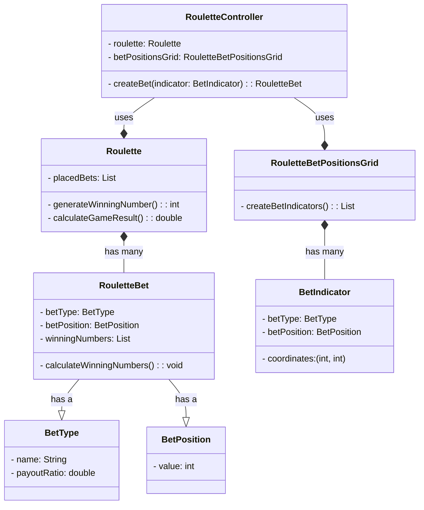

# Meta-relazione per Progettazione e Sviluppo del Software

# Analisi

Il software mette a disposizione degli utenti un Casinò virtuale in cui è possibile giocare tre grandi classici:

- BlackJack
- Roulette
- Dadi

Inoltre il casinò tiene traccia delle partite giocate dagli utenti e da la possibilità di visualizzare la classifica dei dieci migliori giocatori in base al capitale con cui sono usciti dal casinò.

I Dadi, a differenza degli altri, sono un gioco bonus che il giocatore può scegliere o meno se giocare nel momento in cui decide di uscire dal casinò.<br/>
Se il giocatore riesce ad indovinare il numero che uscirà dopo il lancio dei dadi allora il suo capitale verrà raddoppiato altrimenti, se sbaglia, verrà dimezzato.

## Requisiti funzionali

All'avvio della applicazione viene visualizzato il **menu principale**, qui è possibile decidere se iniziare a giocare o se visionare la **classifica**.

Se si entra nella **classifica** viene visualizzata una lista di record contententi nome del giocatore ed il valore del capitale con cui il giocatore è uscito dal casinò. Proprio perchè questa lista rappresenta la top 10 dei migliori giocatori, sarà limitata solamente a dieci record ed ordinata in maniera decrescente rispetto al capitale. Da qui l'utente potrà solo tornare indietro al **menu principale**.<br/>

Se dal **menu principale** si entra nel casinò viene richiessto all'utente di inserire un nome, con il quale sarà registrato ed eventualmente salvato in **classifica**. Una volta completata la registrazione viene visualizzato un secondo menu, il **menu dei giochi**, in cui è possibile scegliere tra **Roulette** e **BlackJack**.

Nella **Roulette** sarà possibile selezionare e piazzare più tipi di scommesse, eliminare le scommesse precedentemente piazzate e premere un bottone per mostrare il numero uscente.

Nel **Blackjack**, tramite interfaccia apposita, i giocatori possono ricevere carte e decidere se "restare" o richiedere carte, il banco si occupa di dare e mescolare le carte.

Ricapitolando, l'utente può fare avanti ed indietro tra il **menu dei giochi** ed i giochi stessi ma nel momento in cui dedice di uscire dal casino ha la possibilità di scegliere se giocare o meno ad il gioco dei **Dadi**.

Quello dei **Dadi** è un gioco bonus in cui il giocatore deve inserire un numero per indovinare la combinazione uscente dopo il lancio dei dadi.

Una volta giocato o meno ad i **Dadi** l'utente è uscito dal casinò e si ritrova al punto di partenza, il **menu principale**

## Requisiti non funzionali

- Funzionalità drag and drop nella roulette, prendi le fiches e le trascini nelle caselle del tabellone per puntare.
- Funzionalità drag and "throw" nei dadi, sarà possibile trascinare un bicchiere che prende i dadi al suo interno, si potranno mischiare tramite movimento del cursore e al rilascio i dadi verranno lanciati.
- Classifica non più locale ma online, tramite librerie per lo scambio di messaggi in rete la classifica si aggiornerà con i nomi di tutti coloro che hanno fatto un buon punteggio anche in istanze diverse dell'applicazione.
- Salvataggio partita a metà, possibilità di mettere in pausa la partita attuale per riprenderla successivamente anche alla chiusura dell'applicazione.

## Analisi e modello del dominio

All'interno dell'applicazione l'utente (Player) dovrà potersi muoversi tra il menu pricipale, la classifica, il menu dei giochi, ed i giochi stessi.
Inoltre in ogni gioco, l'utente, sarà in grado di piazzare una o più scommesse ed ottenere il risultato del gioco


Al fine di garantire un'esperienza di gioco fluida e stabile nella prima release, abbiamo deciso di concentrarci sull'implementazione delle funzionalità core del casinò. Le interazioni avanzate come il drag and drop e le funzionalità online, pur essendo altamente desiderabili, richiederanno un ulteriore sviluppo e saranno pertanto oggetto di future iterazioni del prodotto.

# Design

## Architettura

l'architettura di **Virtual Casinò** è di tipo MVC, dove ogni componente principale ha una parte di _model_, dove c'è la logica del componente, una parte di _view_, cioè la parte visuale e con cui l'utente interagisce e per concludere la parte cardine, il controller.

Quest'ultimo è ciò che permette di collegare model e view, prendendo gli input da quest'ultima per poi passarli al model che li elabora e restituire gli output nuovamente alla view.
I macro controller sono **BaseController**, scheletro generico usato da tutti, e **BaseGameController** più specifico, utilizzato dai giochi e che estende quello precedente.
Il primo è sicuramente quello più interessante dove è presente la logica per ricevere e passare dati tra view. Per funzionare usa un _singleton_ cioè una classe già inizializzata con un'istanza che rappresenta il **Player** e permette di salvare le varie informazioni, come nome e saldo.


Nell'UML sopra viene mostrato in maniera sintetica come funziona la comunicazione tra vari componenti e l'implementazione del pattern MVC.

## Design dettagliato - Matteo Calvanico

### Blackjack Game

Rappresentazione UML **minimale** del Blackjack:


La sfida principale nell'implementazione del gioco è stata la gestione di tutti i vari mazzi (successivamente nel dettaglio la gestione delle carte). Infatti nel gioco del Blackjack i mazzi sono molteplici:
- Mazzo del banco (dealer): che rappresenta il numero da battere.
- Mazzi del giocatore: ben due, il primo è quello principale e il secondo usato in caso di *split*.
- Mazzi da gioco: i mazzi da dove si prendono le carte da assegnare, normalmente possono variare tra 2 e 6 (in base al tipo di blackjack) e quando uno finisce si cambia subito con un altro.

## Problema
Fin da subito si è capito che il mazzo più complicato da gestire sarebbe stato quello da gioco, creato tramite una lista di **Deck**, infatti è necessario tenere conto del numero di mazzo utilizzato e, se necessario, cambiarlo prima di ogni azione per evitare di andare in eccessione.

## Soluzione
Per far fronte a questo continuo controllo si è creato un indice, chiamato **playDeckIndex**, per tenere conto del mazzo utilizzato e un metodo, chiamato **checkAndChangeDeck**, che controlla se il mazzo è finito e in caso lo cambia, in modo da far continuare il gioco senza far notare nulla al player.


### Gestione delle carte

Rappresentazione UML della gestione delle carte


#### Problema

Gestire le varie informazioni (semi, valore, colore) delle carte in maniera pulita e riusicire a creare un mazzo equilibrato e velocemente.

#### Soluzione

Utilizzo degli Enumeratori per le informazioni, dove ognuno contiene determinati valori che sono anche iterabili, permettendo di creare in **Deck** un mazzo seguendo le regole classiche delle carte francesi e senza troppe righe di codice.

Inoltre visto la necessità di dover rappresentare lo stato della carta (Nascosta/Visibile) si è pensato di aggiungere un flag per indicare se la carta è girata o meno, accessibile tramite setter e getter.


### Condivisione informazioni Player

Rappresentazione UML del pattern Singleton per salvare e condividere le informazioni del Player tra le varie scene.


#### Problema

Riuscire a mantenere salvata l'istanza del player, in modo da gestire le varie vincite/perdite e condividere le informazioni tra le varie scene

#### Soluzione

Utilizzo del design patter _Singleton_, dove si salva il Player e si modifica utilizzando i metodi della classe singleton tramite l'istanza creata privatamente e resa disponibile tramite un metodo pubblico


## Design dettagliato - Filippo Monti

## Design dettagliato - Giacomo Ghinelli

### Roulette Game

Il gioco della Roulette, per quanto semplice possa sembrare a primo impatto, è un gioco che possiede una grande variabilità in termini di tipologia di scommesse. In questo gioco esistono ben 149 tipologie di scommesse diverse.
Al fine di gestire in modo efficace questa grossa variabilità, oltre che per separare e differenziare il più possibile la logica interna del gioco e stato progettato un sistema basato su tre modelli principali: **Roulette**, **RouletteBet** e **RouletteBetPositionsGrid**.

Tutti e tre questi modelli estendono una classe base contentente costanti di valori e sequenze specifiche e condivise nel gioco della roulette.

La classe Roulette si occupa principalmente della gestione della lista di scommesse piazzate e della generazione del numero vincente sulla base del quale viene calcolato il risultato della partita.

La classe RouletteBetPositionsGrid e RouletteBet contengono la logica che permette la gestione di tutte le tipologie di scommesse diverse:

- RouletteBetPositionsGrid presenta al controller le possibili posizioni delle scommesse all'interno della tavola dei numeri.
- RouletteBet contiene la logica che permette di converire tipologia e posizione della scommessa nella combinazione di numeri vincenti.



# Sviluppo

## Testing automatizzato

Il testing automatizzato è un requisito di qualunque progetto software
che si rispetti, e consente di verificare che non vi siano regressioni
nelle funzionalità a fronte di aggiornamenti.
Per quanto riguarda questo
progetto è considerato sufficiente un test minimale, a patto che sia
completamente automatico. Test che richiedono l'intervento da parte
dell'utente sono considerati _negativamente_ nel computo del punteggio
finale.

### Elementi positivi

- Si descrivono molto brevemente i componenti che si è deciso di
  sottoporre a test automatizzato.
- Si utilizzano suite specifiche (e.g. JUnit) per il testing
  automatico.

### Elementi negativi {#elementi-negativi-4 .unnumbered}

- Non si realizza alcun test automatico.
- La non presenza di testing viene aggravata dall'adduzione di
  motivazioni non valide. Ad esempio, si scrive che l'interfaccia
  grafica non è testata automaticamente perché è _impossibile_
  farlo (testare in modo automatico le interfacce grafiche è possibile, si veda, come esempio,
  [TestFX](https://github.com/TestFX/TestFX);
  semplicemente, nel corso non c'è modo e tempo di introdurvi questo
  livello di complessità).
- Si descrive un testing di tipo manuale in maniera prolissa.
- Si descrivono test effettuati manualmente che sarebbero potuti
  essere automatizzati, ad esempio scrivendo che si è usata
  l'applicazione manualmente.
- Si descrivono test non presenti nei sorgenti del progetto.
- I test, quando eseguiti, falliscono.

## Note di sviluppo - Matteo Calvanico

### Utilizzo della libreria Media di JavaFX

**Dove**: Nella classe `it.unibo.virtualCasino.controller`, dentro al metodo _playSound_, che verrà chiamato ogni volta che bisogna far partire un suono.

**Permalink**: https://github.com/MatteoCalvanico/pss23-Calvanico-Monti-Ghinelli-VirtualCasino/blob/master/src/main/java/it/unibo/virtualCasino/controller/BaseController.java#L104

**Snippet**:

```java
protected void playSound(String soundFilePath) {
    URL resource = getClass().getResource(soundFilePath);

    if (resource == null) {
        throw new IllegalArgumentException("File path is null");
    }

    try {
        Media soundFile = new Media(resource.toString());
        MediaPlayer mediaPlayer = new MediaPlayer(soundFile);
        mediaPlayer.play();
    } catch (Exception e) {
        throw new IllegalArgumentException("Error playing sound: " + soundFilePath);
    }
}
```

### Utilizzo operatore ternario

**Dove**: in diverse classi, ad esempio: `it.unibo.virtualCasino.model.games.impl.blackjack`

**Permalink**: https://github.com/MatteoCalvanico/pss23-Calvanico-Monti-Ghinelli-VirtualCasino/blob/master/src/main/java/it/unibo/virtualCasino/model/games/impl/blackjack/Blackjack.java#L243

**Snippet**:

```java
public boolean isBlackjack() {
    return (playerDeck[0].size() == 2 && playerDeck[0].countCard() == 21) ? true : false;
    }
```

### Utilizzo Optional di java.util

**Dove**: Nella classe `it.unibo.virtualCasino.controller.menu.MainMenuController` in _showGames()_

**Permalink**: https://github.com/MatteoCalvanico/pss23-Calvanico-Monti-Ghinelli-VirtualCasino/blob/master/src/main/java/it/unibo/virtualCasino/controller/menu/MainMenuController.java#L105

**Snippet**:

```java
void showGames(ActionEvent event) {
    ...
    Optional<String> result;
    String name = "";
    boolean validName = false;

    while (!validName) {
        result = dialog.showAndWait();
        if (result.isPresent()) {
            name = result.get().trim();
            if (name.isEmpty()) {
                dialog.setHeaderText("Name cannot be empty. Please enter your name:");
            } else if (Scoreboard.containsName(name)) {
                dialog.setHeaderText("Invalid name. Name already exists on the casino scoreboard!");
            } else {
                validName = true;
            }
        } else {
            return;
        }
    }
    ...
}
```

## Note di sviluppo - Filippo Monti

## Note di sviluppo - Giacomo Ghinelli

# Commenti finali

In quest'ultimo capitolo si tirano le somme del lavoro svolto e si
delineano eventuali sviluppi futuri.

**Nessuna delle informazioni incluse in questo capitolo verrà utilizzata
per formulare la valutazione finale**, a meno che non sia assente o
manchino delle sezioni obbligatorie. Al fine di evitare pregiudizi
involontari, l'intero capitolo verrà letto dai docenti solo dopo aver
formulato la valutazione.

## Autovalutazione e lavori futuri

### Matteo Calvanico
Per quanto riguarda la mia parte all'interno del progetto (Blackjack e vari menù) sono più che soddisfatto, soprattuto della parte di *Controller* e *View* dove credo di aver passato anche la maggior parte del tempo. Per quanto riguarda il *Model del Blackjack*, anche se sono estremamente soddisfatto, credo di poter fare alcuni miglioramenti, soprattutto perchè è stata sviluppata molto prima e con parecchi mesi di distanza dalle altre e nel mentre sono "migliorato" come sviluppatore.

Come team abbiamo lavorato molto bene insieme e credo che il carico di lavoro sia stato abbastanza equilibrato, forse solo la di Roulette (sviluppata da Giacomo) è più complicata concettualmente rispetto alle altre e quindi ha richiesto più impegno da parte sua.

Vorrei aggiungere che mi piacerebbe molto implementare altri giochi in futuro, rendendo l'applicativo simile a quello pre-installato su Windows (*Solitaire & Casual Games*). Alcune possibili aggiunte potrebbero essere Mahjong e Caravan (*Fallout: New Vegas*)

### Filippo Monti

## Giacomo Ghinelli

## Difficoltà incontrate e commenti per i docenti

Questa sezione, **opzionale**, può essere utilizzata per segnalare ai
docenti eventuali problemi o difficoltà incontrate nel corso o nello
svolgimento del progetto, può essere vista come una seconda possibilità
di valutare il corso (dopo quella offerta dalle rilevazioni della
didattica) avendo anche conoscenza delle modalità e delle difficoltà
collegate all'esame, cosa impossibile da fare usando le valutazioni in
aula per ovvie ragioni. È possibile che alcuni dei commenti forniti
vengano utilizzati per migliorare il corso in futuro: sebbene non andrà
a vostro beneficio, potreste fare un favore ai vostri futuri colleghi.
Ovviamente **il contenuto della sezione non impatterà il voto finale**.

# Guida utente

L'utilizzo dell'applicativo è abbastanza banale, all'avvio sarà possibile iniziare una nuova partita o vedere la classifica (in caso di primo avvio la classifica sarà normalmente vuota).

All'avvio di una nuova partita sarà richiesto un nome, finchè non lo si inserirà non sarà possibile continuare, successivamente vi sarannò accreditati 1000 crediti e finiti questi non sarà più possibile giocare ad altro. Se si decide di uscire sarà possibile giocare opzionalmente al bonus **Dadi** che permette di raddoppiare o azzerrare i vostri crediti in base all'esito del gioco.

Ora davanti a voi sarà presente la scelta dei giochi, di seguito le regole nel dettaglio...

## Blackjack
Per iniziare a giocare bisogna fare una puntata, è possibile puntare di 100 alla volta, e appena confermata la puntata(pulsante *Set bet* collocato a destra) la partita inizia.

All'inizio del turno voi e il banco riceverete due carte (nel suo caso una è girata), il vostro scopo è fare più del banco ma senza superare il 21, se fate 21 con le prime due carte vincete automaticamente (il cosidetto **blackjack**). 

Durante il gioco avete a disposizione tre pulsanti:
- *Split*: se avete due carte uguali potete spostarne una nel secondo mazzo a se stante, quindi non importa quanto fate nell'altro, e come fare due partite contemporaneamente con due puntate uguali.
- *+*: come potete immaginare serve per riceve una carta nel mazzo corrispondente...attenzione a non chiederne troppe.
- *Stay*: anche qui abbastanza esplicativo, fa capire al dealer che non si vogliono più carte, può voler dire fine del turno e quindi mostrare i risultati.

Si può uscire in qualsiasi momento (tranne quando è in corso un turno) dal comodo pulsante *Exit* posto a destra sotto la sezione delle scommesse.

## Roulette

## Dadi